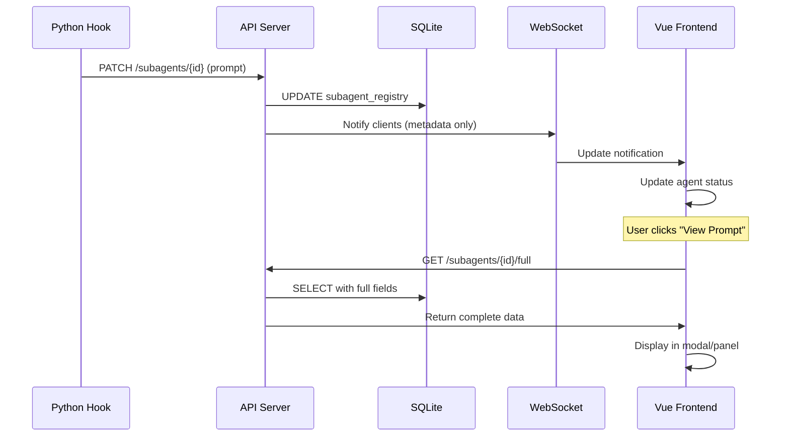

# Agent Prompt/Response Capture Architecture

**Author:** AlexOrbit (System Architect)  
**Date:** 2025-08-14  
**Status:** Active Architecture Decision  

## Executive Summary

This document defines the architecture for capturing, storing, and displaying agent prompts and responses in the multi-agent observability system. The design prioritizes performance, scalability, and user experience when handling large text data (up to 1MB per field).

## Architecture Decision Record (ADR-001)

### Context
The system needs to capture and display the full prompts sent to create subagents and their complete responses for debugging, auditing, and analysis purposes. Current implementation captures metadata but not actual content.

### Decision
Extend the existing `subagent_registry` table with TEXT columns for prompt/response storage, implementing progressive loading and lazy fetching patterns throughout the stack.

### Consequences
- **Positive:** Simple schema, single source of truth, backward compatible
- **Negative:** Large table rows, requires careful query optimization
- **Mitigations:** Implement separate endpoints for metadata vs full data

## System Architecture

### 1. Data Capture Layer (Python Hooks)

```python
# Hook Integration Points
PreToolUse Hook:
  - Intercept Task() calls
  - Extract: tool_input.prompt
  - Correlation: session_id + agent_name
  - Send to: PATCH /subagents/{sessionId}/{name}

PostToolUse Hook:
  - Capture tool_response content
  - Extract: final response, tool calls, metadata
  - Send to: PATCH /subagents/{sessionId}/{name}
```

### 2. Storage Layer (SQLite)

#### Schema Design
```sql
ALTER TABLE subagent_registry ADD COLUMN initial_prompt TEXT;
ALTER TABLE subagent_registry ADD COLUMN final_response TEXT;
ALTER TABLE subagent_registry ADD COLUMN tool_calls TEXT; -- JSON array
ALTER TABLE subagent_registry ADD COLUMN conversation_metadata TEXT; -- JSON object

-- Performance indexes
CREATE INDEX idx_subagent_lookup ON subagent_registry(session_id, name);
```

#### Storage Optimizations
- `PRAGMA cache_size = 5000` for improved query performance
- `PRAGMA journal_mode = WAL` for concurrent access
- Regular VACUUM schedule for storage optimization
- Separate queries for metadata vs full text fields

### 3. API Layer (Node.js/Bun)

#### Endpoint Design

**Primary Update Endpoint:**
```typescript
PATCH /subagents/{sessionId}/{name}
Body: {
  initial_prompt?: string,
  final_response?: string,
  tool_calls?: ToolCall[],
  conversation_metadata?: object
}
```

**Metadata Listing:**
```typescript
GET /subagents/{sessionId}
Returns: AgentStatus[] // Without large text fields
```

**Full Data Retrieval:**
```typescript
GET /subagents/{sessionId}/{name}/full
Returns: CompleteAgentData // Including all text fields
```

#### Performance Features
- Chunked responses for texts >100KB
- Content-Length headers for progress tracking
- ETag support for client caching
- Gzip compression for responses >10KB
- Range request support for partial content

### 4. Frontend Layer (Vue.js)

#### Data Management Strategy

```typescript
// Use shallowRef to avoid reactivity overhead
const agentPrompt = shallowRef<string>('')
const agentResponse = shallowRef<string>('')

// Progressive loading
interface AgentDisplay {
  metadata: AgentStatus // Always loaded
  promptPreview: string // First 500 chars
  responsePreview: string // First 500 chars
  fullPrompt?: string // Loaded on demand
  fullResponse?: string // Loaded on demand
}
```

#### UI/UX Patterns

1. **Progressive Disclosure:**
   - Show first 500 characters with "Show More" button
   - Load full content only when expanded
   - Use Intersection Observer for viewport-based loading

2. **Performance Optimizations:**
   - Virtual scrolling for long text
   - Web Workers for syntax highlighting
   - IndexedDB for client-side caching
   - Debounced scroll handlers

3. **Component Architecture:**
```vue
<AgentDetailPane>
  <MetadataGrid /> <!-- Always visible -->
  <PromptSection>
    <PromptPreview /> <!-- Initial load -->
    <PromptFullView v-if="expanded" /> <!-- Lazy loaded -->
  </PromptSection>
  <ResponseSection>
    <ResponsePreview />
    <ResponseFullView v-if="expanded" />
  </ResponseSection>
</AgentDetailPane>
```

## Data Flow Sequence



## Performance Considerations

### Database Performance
- **Query Separation:** Metadata queries exclude TEXT columns
- **Batch Operations:** Use transactions for multiple updates
- **Index Strategy:** Composite index on (session_id, name)
- **VACUUM Schedule:** Weekly maintenance during low usage

### Network Performance
- **Compression:** Gzip for responses >10KB (70% reduction typical)
- **Chunking:** Split responses >100KB into chunks
- **Caching:** ETag + If-None-Match for client caching
- **WebSocket:** Send notifications only, not full data

### Frontend Performance
- **Lazy Loading:** Load full text only on user action
- **Virtual Scrolling:** For texts >10,000 lines
- **Web Workers:** Offload syntax highlighting
- **Memory Management:** Clear unused full texts after navigation

## Implementation Checklist

### Phase 1: Database & API (Backend)
- [ ] Add columns to subagent_registry table
- [ ] Implement PATCH endpoint for updates
- [ ] Create GET endpoint for full data
- [ ] Add compression middleware
- [ ] Update WebSocket notifications

### Phase 2: Hook Integration
- [ ] Enhance PreToolUse hook for prompt capture
- [ ] Enhance PostToolUse hook for response capture
- [ ] Add error handling and retry logic
- [ ] Implement batching for multiple updates

### Phase 3: Frontend Display
- [ ] Extend AgentStatus interface
- [ ] Create PromptResponseModal component
- [ ] Implement progressive loading
- [ ] Add syntax highlighting
- [ ] Setup client-side caching

### Phase 4: Optimization
- [ ] Implement virtual scrolling
- [ ] Add Web Worker for highlighting
- [ ] Setup IndexedDB caching
- [ ] Performance testing with 1MB texts

## Testing Strategy

### Unit Tests
- Database schema migration
- API endpoint validation
- Data compression/decompression
- Frontend lazy loading logic

### Integration Tests
- End-to-end data flow
- WebSocket notification delivery
- Large text handling (1MB)
- Concurrent access patterns

### Performance Tests
- Load testing with 100+ agents
- Memory usage with large texts
- Network bandwidth optimization
- UI responsiveness metrics

## Security Considerations

1. **Input Validation:** Sanitize prompts/responses before storage
2. **Size Limits:** Enforce 1MB max per field
3. **Rate Limiting:** Prevent abuse of full data endpoints
4. **Access Control:** Verify session ownership
5. **XSS Prevention:** Escape content before rendering

## Monitoring & Metrics

- Database storage growth rate
- API response times for full data
- Cache hit rates
- Frontend memory usage
- User interaction patterns (expand rate)

## Future Enhancements

1. **Streaming Responses:** Server-sent events for real-time updates
2. **Diff Visualization:** Show changes between prompt iterations
3. **Search Within Text:** Full-text search capabilities
4. **Export Functionality:** Download prompts/responses as files
5. **Collaborative Annotations:** Team comments on prompts

## Conclusion

This architecture provides a scalable, performant solution for capturing and displaying agent prompts and responses. The progressive enhancement approach ensures good performance even with large text data, while maintaining a simple and maintainable codebase.

The key to success is separation of concerns: metadata is always fast, full data is loaded on demand, and the UI provides clear feedback about data availability and loading states.