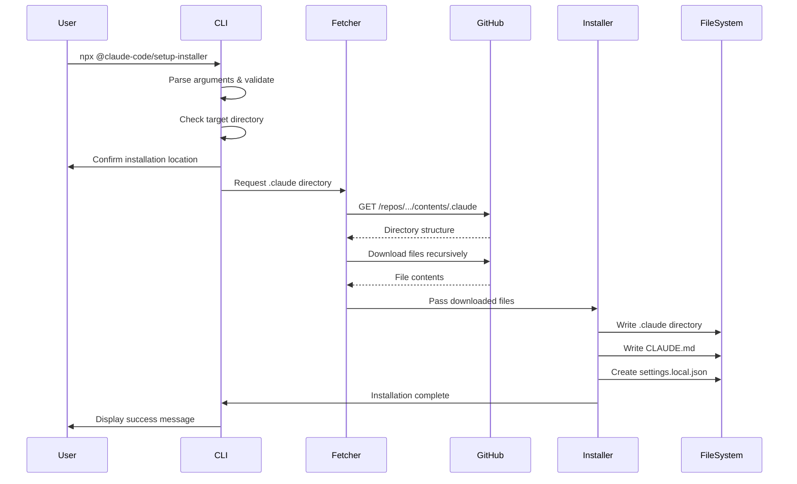

# NPX Claude Setup Installer - Architecture Design

## Executive Summary

This document defines the architecture for an NPX-installable package that enables users to quickly install the Claude multi-agent orchestration setup into their projects with a single command.

## Package Naming Recommendation

**Recommended package name**: `@claude-code/setup-installer`

**Command usage**: 
```bash
npx @claude-code/setup-installer
```

Alternative names considered:
- `claude-code-setup` (simpler, but less scoped)
- `install-claude-orchestration` (too verbose)
- `claude-multi-agent-setup` (too specific)

## Architecture Overview

### System Components

```
┌─────────────────────────────────────────────────────────────┐
│                        User's Machine                        │
├─────────────────────────────────────────────────────────────┤
│                                                               │
│  ┌──────────────────┐      ┌──────────────────────────────┐ │
│  │   NPX Command     │      │   Target Project Directory   │ │
│  │                   │      │                              │ │
│  │ npx @claude-code/ │      │  my-project/                 │ │
│  │ setup-installer   │─────>│    ├── .claude/              │ │
│  └──────────────────┘       │    └── CLAUDE.md             │ │
│           │                 └──────────────────────────────┘ │
│           │                                                   │
│           ▼                                                   │
│  ┌──────────────────────────────────────────────────────┐   │
│  │            NPX Installer Package                      │   │
│  ├──────────────────────────────────────────────────────┤   │
│  │                                                       │   │
│  │  ┌─────────────┐  ┌──────────────┐  ┌────────────┐  │   │
│  │  │    CLI      │  │   Fetcher    │  │  Installer │  │   │
│  │  │  Interface  │──│   Module     │──│   Module   │  │   │
│  │  └─────────────┘  └──────────────┘  └────────────┘  │   │
│  │         │                │                  │         │   │
│  │         │                ▼                  │         │   │
│  │         │       ┌──────────────────┐        │         │   │
│  │         │       │   GitHub API     │        │         │   │
│  │         │       │   Integration    │        │         │   │
│  │         │       └──────────────────┘        │         │   │
│  │         │                │                  │         │   │
│  │         ▼                ▼                  ▼         │   │
│  │  ┌────────────────────────────────────────────────┐  │   │
│  │  │          Error Handler & Logger                 │  │   │
│  │  └────────────────────────────────────────────────┘  │   │
│  └──────────────────────────────────────────────────────┘   │
│                                                               │
└─────────────────────────────────────────────────────────────┘
                                │
                                ▼
┌─────────────────────────────────────────────────────────────┐
│                         GitHub Repository                     │
│                                                               │
│  alexsavage/claude-code-hooks-multi-agent-observability      │
│    ├── .claude/                                              │
│    │   ├── agents/                                           │
│    │   ├── commands/                                         │
│    │   ├── hooks/                                            │
│    │   └── settings.json                                     │
│    └── CLAUDE.md                                             │
└─────────────────────────────────────────────────────────────┘
```

## Package Structure

```
@claude-code/setup-installer/
├── package.json
├── README.md
├── LICENSE
├── .npmignore
├── bin/
│   └── claude-setup.js          # Main CLI entry point
├── src/
│   ├── index.js                 # Core orchestrator
│   ├── cli/
│   │   ├── prompts.js          # User interaction
│   │   ├── parser.js           # Argument parsing
│   │   └── validator.js        # Input validation
│   ├── fetcher/
│   │   ├── github.js           # GitHub API client
│   │   ├── cache.js            # Local caching logic
│   │   └── downloader.js       # File download manager
│   ├── installer/
│   │   ├── file-writer.js      # File system operations
│   │   ├── dependency-check.js # Check for Python/uv
│   │   └── post-install.js     # Post-installation tasks
│   ├── utils/
│   │   ├── logger.js           # Logging utilities
│   │   ├── errors.js           # Error handling
│   │   └── platform.js         # Cross-platform helpers
│   └── config/
│       ├── defaults.js         # Default configurations
│       └── repository.js       # Repository constants
├── templates/
│   └── settings.local.json     # Template for local settings
└── test/
    ├── unit/
    ├── integration/
    └── fixtures/
```

## Implementation Approach

### 1. File Fetching Mechanism

**Chosen Approach**: Hybrid GitHub API strategy optimized for performance

```javascript
// Primary: GitHub Trees API for .claude directory (fastest for recursive fetch)
const GITHUB_TREES_API = 'https://api.github.com/repos/alexsavage/claude-code-hooks-multi-agent-observability/git/trees/main?recursive=1';

// Alternative: tar.gz archive for full directory (degit-style, very fast)
const GITHUB_ARCHIVE = 'https://github.com/alexsavage/claude-code-hooks-multi-agent-observability/archive/refs/heads/main.tar.gz';

// Individual files: GitHub Contents API
const GITHUB_CONTENTS_API = 'https://api.github.com/repos/alexsavage/claude-code-hooks-multi-agent-observability/contents/CLAUDE.md';

// Fallback: Direct raw file access
const GITHUB_RAW_BASE = 'https://raw.githubusercontent.com/alexsavage/claude-code-hooks-multi-agent-observability/main';
```

**Optimized Strategy** (based on researcher findings):
1. Use GitHub Trees API for efficient recursive .claude directory listing (handles up to 100k files)
2. Fetch individual file contents in parallel batches
3. Use Contents API for single files like CLAUDE.md
4. Fallback to tar.gz archive approach for rate limit scenarios
5. Final fallback to raw URLs if all else fails

**Rationale**:
- Trees API is most efficient for recursive directory fetching
- Tar.gz approach (degit-style) provides fastest bulk download
- Contents API optimal for individual files
- Multiple fallback strategies ensure reliability
- No need to bundle files, always fetches latest from main branch
- Supports version pinning via tags/commits

### 2. Installation Flow



### 3. CLI Interface Design

```bash
# Basic usage
npx @claude-code/setup-installer

# With options
npx @claude-code/setup-installer --dir ./my-project
npx @claude-code/setup-installer --version v1.2.0
npx @claude-code/setup-installer --force
npx @claude-code/setup-installer --no-python-check
```

**Interactive Prompts**:
1. Confirm installation directory
2. Handle existing files (skip/overwrite/backup)
3. Optional: Configure observability server URL

### 4. Error Handling Strategy

```javascript
class InstallerError extends Error {
  constructor(message, code, details) {
    super(message);
    this.code = code;
    this.details = details;
  }
}

// Error codes
const ERROR_CODES = {
  NETWORK_ERROR: 'E001',
  GITHUB_RATE_LIMIT: 'E002',
  FILE_WRITE_ERROR: 'E003',
  DEPENDENCY_MISSING: 'E004',
  USER_CANCELLED: 'E005'
};
```

### 5. Cross-Platform Compatibility

- Use Node.js `path` module for all file paths
- Detect OS and adjust Python/uv checks accordingly
- Handle Windows line endings in text files
- Use `fs.promises` for async file operations
- Test on Windows, macOS, and Linux CI environments

## Technology Stack

### Core Dependencies

```json
{
  "dependencies": {
    "node-fetch": "^3.3.0",      // GitHub API requests
    "ora": "^6.0.0",              // Progress spinners
    "chalk": "^5.0.0",            // Colored output
    "prompts": "^2.4.0",          // Interactive prompts
    "commander": "^11.0.0",       // CLI argument parsing
    "fs-extra": "^11.0.0"         // Enhanced file operations
  },
  "devDependencies": {
    "jest": "^29.0.0",            // Testing framework
    "nock": "^13.0.0",            // HTTP mocking
    "mock-fs": "^5.0.0"           // File system mocking
  }
}
```

### Node.js Version Requirements

- Minimum: Node.js 18.x (LTS)
- Recommended: Node.js 22.x (Current LTS as of 2025)
- Engine specification in package.json:
```json
{
  "engines": {
    "node": ">=18.0.0",
    "npm": ">=9.0.0"
  }
}
```

## Testing Strategy

### 1. Unit Tests

**Coverage Target**: 90%

```javascript
// test/unit/fetcher/github.test.js
describe('GitHub Fetcher', () => {
  test('fetches directory structure correctly');
  test('handles rate limiting with retry');
  test('falls back to raw URLs on API failure');
  test('validates GitHub responses');
});
```

### 2. Integration Tests

```javascript
// test/integration/installation.test.js
describe('Full Installation Flow', () => {
  test('installs to empty directory');
  test('handles existing files with user prompts');
  test('creates valid settings.local.json');
  test('preserves file permissions');
});
```

### 3. E2E Tests

```bash
# CI pipeline test
npm pack
npx ./claude-code-setup-installer-*.tgz --dir ./test-project
# Verify installation
test -d ./test-project/.claude
test -f ./test-project/CLAUDE.md
```

### 4. Cross-Platform Testing

- GitHub Actions matrix for Windows, macOS, Linux
- Docker containers for Linux distribution testing
- Manual testing on different Node.js versions

### 5. Mock Strategy

```javascript
// Mocking external dependencies
const mockGitHubAPI = nock('https://api.github.com')
  .get('/repos/alexsavage/claude-code-hooks-multi-agent-observability/contents/.claude')
  .reply(200, mockDirectoryResponse);

// Mocking file system
mockFs({
  '/target/directory': {}
});
```

## Version Management

### Semantic Versioning

- **Major**: Breaking changes to CLI interface
- **Minor**: New features, additional options
- **Patch**: Bug fixes, documentation updates

### Version Pinning Support

```bash
# Install specific version of setup files
npx @claude-code/setup-installer@1.2.0 --tag v1.2.0

# Default: always fetches from main branch
npx @claude-code/setup-installer
```

## Security Considerations

1. **HTTPS Only**: All GitHub requests use HTTPS
2. **No Execution**: Downloaded files are not executed during installation
3. **Path Validation**: Prevent directory traversal attacks
4. **Checksum Verification**: Optional integrity checking
5. **Rate Limiting**: Respect GitHub API limits with exponential backoff

## Performance Optimizations

1. **Parallel Downloads**: Fetch multiple files concurrently
2. **Progress Indication**: Show download/installation progress
3. **Caching**: Optional local cache for repeated installations
4. **Compression**: Support for gzipped transfers
5. **Minimal Dependencies**: Keep package size small

## User Experience

### Success Path
```
$ npx @claude-code/setup-installer

🚀 Claude Code Setup Installer v1.0.0
📍 Installing to: /Users/developer/my-project
✔ Fetching latest setup from GitHub...
✔ Creating .claude directory...
✔ Installing hooks and agents...
✔ Creating CLAUDE.md...
✔ Generating settings.local.json...

✅ Installation complete!

Next steps:
1. Review .claude/settings.local.json for configuration
2. Ensure Python and uv are installed for hooks
3. Start the observability server (optional)
4. Open your project in Claude Code

Happy coding with Claude! 🤖
```

### Error Handling Example
```
$ npx @claude-code/setup-installer

🚀 Claude Code Setup Installer v1.0.0
📍 Installing to: /Users/developer/my-project
⚠️  Found existing .claude directory

? What would you like to do?
  ❯ Backup and replace
    Skip existing files
    Cancel installation
```

## Maintenance & Updates

### Release Process

1. Update version in package.json
2. Run full test suite
3. Create GitHub release tag
4. Publish to npm registry
5. Update documentation

### Monitoring

- Track npm download statistics
- Monitor GitHub issues for bug reports
- Collect anonymous usage telemetry (opt-in)

## Implementation Priorities

### Phase 1: MVP (Week 1)
- [x] Architecture design
- [ ] Basic CLI with directory fetching
- [ ] GitHub API integration
- [ ] File installation logic
- [ ] Basic error handling

### Phase 2: Enhanced UX (Week 2)
- [ ] Interactive prompts
- [ ] Progress indicators
- [ ] Better error messages
- [ ] Cross-platform testing

### Phase 3: Production Ready (Week 3)
- [ ] Comprehensive testing
- [ ] Documentation
- [ ] CI/CD pipeline
- [ ] npm publication

## Conclusion

This architecture provides a robust, user-friendly solution for installing the Claude multi-agent orchestration setup. The design prioritizes simplicity, reliability, and cross-platform compatibility while maintaining flexibility for future enhancements.