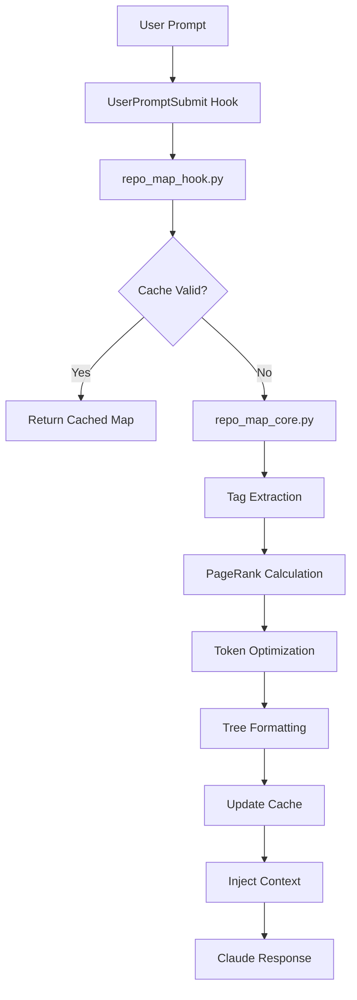

# Repository Map Architecture

## Executive Summary

This document defines the architecture for integrating tree-sitter based repository mapping into the Claude Code hooks system. The implementation provides intelligent code context by generating concise, ranked repository maps that fit within token limits while maximizing relevance to the current conversation.

## System Overview

### Purpose
Generate a compact, context-aware map of the codebase that provides Claude with essential structural understanding without consuming excessive context tokens.

### Key Design Decisions

1. **Tree-sitter Integration**: Use tree-sitter for language-agnostic AST parsing
2. **Graph-based Ranking**: PageRank algorithm for determining code importance
3. **Incremental Caching**: Multi-level caching strategy for performance
4. **Token-aware Optimization**: Binary search for optimal map size within limits
5. **Hook-based Integration**: Seamless integration via UserPromptSubmit hook

## Architecture Components

### 1. Core Modules

#### `repo_map_core.py`
- **Responsibility**: Core repository mapping logic
- **Key Classes**:
  - `RepoMapGenerator`: Main orchestrator
  - `TagExtractor`: Tree-sitter based tag extraction
  - `RankCalculator`: PageRank implementation
  - `TreeFormatter`: Output formatting
- **Dependencies**: tree-sitter, networkx

#### `repo_map_cache.py`
- **Responsibility**: Multi-level caching system
- **Key Classes**:
  - `TagsCache`: File-level tag caching with mtime validation
  - `MapCache`: Complete map caching with dependency tracking
  - `TreeCache`: Rendered tree caching
- **Storage**: SQLite via diskcache for persistence

#### `repo_map_hook.py`
- **Responsibility**: Hook integration layer
- **Key Functions**:
  - `inject_repo_map()`: Main hook entry point
  - `get_chat_context()`: Extract current chat files
  - `format_output()`: Prepare hook-compliant response

### 2. Supporting Modules

#### `language_support.py`
- **Responsibility**: Language-specific configurations
- **Key Functions**:
  - `get_parser()`: Language-specific parser retrieval
  - `get_query_scm()`: Tag query schemas
  - `get_supported_languages()`: Runtime language detection

#### `token_optimizer.py`
- **Responsibility**: Token budget optimization
- **Key Classes**:
  - `TokenCounter`: Efficient token estimation
  - `BinarySearchOptimizer`: Optimal map size finder
- **Algorithm**: Binary search with early termination

## Data Flow



## Processing Pipeline

### Phase 1: Initialization
1. Hook receives user prompt
2. Extract session context
3. Identify chat files and mentioned identifiers

### Phase 2: Tag Extraction
1. Parse files with tree-sitter
2. Extract definitions and references
3. Cache results with mtime validation

### Phase 3: Ranking
1. Build dependency graph
2. Apply PageRank with personalization
3. Weight by relevance factors:
   - File in active chat: 50x boost
   - Mentioned identifier: 10x boost
   - Snake/camel case: 10x boost
   - Private members: 0.1x penalty

### Phase 4: Optimization
1. Binary search for optimal tag count
2. Target: max tokens within budget
3. Tolerance: ±15% of target

### Phase 5: Formatting
1. Group tags by file
2. Render tree context
3. Truncate long lines (100 chars)
4. Add file structure indicators

## Interface Contracts

### Hook Input Interface
```python
{
    "prompt": str,              # User's prompt
    "session_id": str,          # Session identifier
    "chat_files": List[str],    # Files in current chat
    "mentioned_files": List[str], # Files mentioned in prompt
    "mentioned_idents": List[str] # Identifiers mentioned
}
```

### Hook Output Interface
```python
{
    "hookSpecificOutput": {
        "hookEventName": "UserPromptSubmit",
        "additionalContext": str  # Generated repo map
    }
}
```

### Internal APIs

#### RepoMapGenerator API
```python
class RepoMapGenerator:
    def generate_map(
        self,
        chat_files: List[str],
        other_files: List[str],
        max_tokens: int = 1024,
        mentioned_fnames: Set[str] = None,
        mentioned_idents: Set[str] = None
    ) -> str:
        """Generate optimized repository map."""
```

#### TagExtractor API
```python
class TagExtractor:
    def extract_tags(self, filepath: str) -> List[Tag]:
        """Extract AST tags from file."""
```

## Caching Strategy

### Three-Level Cache Hierarchy

1. **Tag Cache** (File Level)
   - Key: (filepath, mtime)
   - Value: List of tags
   - Invalidation: File modification

2. **Map Cache** (Request Level)
   - Key: (chat_files, other_files, max_tokens, mentions)
   - Value: Generated map string
   - Invalidation: Cache refresh settings

3. **Tree Cache** (Render Level)
   - Key: (filepath, lines_of_interest, mtime)
   - Value: Rendered tree
   - Invalidation: File modification

### Cache Configuration
```python
CACHE_CONFIG = {
    "cache_dir": ".aider.tags.cache.v4",
    "cache_threshold": 0.95,  # Memory usage threshold
    "refresh_modes": ["auto", "manual", "always", "files"],
    "default_refresh": "auto"
}
```

## Performance Considerations

### Optimization Strategies

1. **Incremental Processing**
   - Only reprocess modified files
   - Reuse cached tags when possible

2. **Lazy Loading**
   - Parse files on-demand
   - Defer tree rendering until needed

3. **Parallel Processing**
   - Concurrent file parsing (future)
   - Batch tag extraction

4. **Memory Management**
   - LRU eviction for in-memory caches
   - Disk-based cache with size limits

### Performance Targets
- Initial scan: < 5s for 1000 files
- Cached retrieval: < 100ms
- Incremental update: < 500ms
- Memory usage: < 100MB for large repos

## Testing Strategy

### Unit Test Coverage

1. **Tag Extraction Tests**
   - Multiple language support
   - Edge cases (empty files, syntax errors)
   - Unicode handling

2. **Ranking Algorithm Tests**
   - Graph construction correctness
   - PageRank convergence
   - Personalization effects

3. **Token Optimization Tests**
   - Binary search convergence
   - Token counting accuracy
   - Edge cases (empty repo, huge files)

4. **Cache Tests**
   - Cache invalidation
   - Concurrent access
   - Persistence across restarts

### Integration Tests

1. **Hook Integration**
   - End-to-end flow
   - Error handling
   - Timeout behavior

2. **Language Support**
   - All supported languages
   - Mixed language repos
   - File type detection

### Performance Tests

1. **Load Testing**
   - Large repositories (10k+ files)
   - Token limit stress testing
   - Cache performance under load

2. **Memory Profiling**
   - Memory leak detection
   - Cache size management
   - Resource cleanup

## Error Handling

### Graceful Degradation
1. Parser failures: Skip file, log warning
2. Cache corruption: Rebuild cache
3. Token limit exceeded: Truncate intelligently
4. File access errors: Skip with warning

### Error Response Format
```python
{
    "error": str,           # Error message
    "fallback": str,        # Minimal context
    "recovery_action": str  # Suggested action
}
```

## Security Considerations

1. **File Access Control**
   - Respect .gitignore patterns
   - Honor file permissions
   - Validate path traversal

2. **Cache Security**
   - Secure cache directory permissions
   - Validate cache integrity
   - Sanitize cached data

3. **Resource Limits**
   - Max file size limits
   - Timeout on parsing
   - Memory usage caps

## Migration Plan

### Phase 1: Core Implementation
- Implement tag extraction
- Basic ranking algorithm
- Simple caching

### Phase 2: Optimization
- Token optimization
- Advanced caching
- Performance tuning

### Phase 3: Enhancement
- Additional language support
- Parallel processing
- Advanced ranking features

## Configuration

### Environment Variables
```bash
REPO_MAP_MAX_TOKENS=1024      # Default token budget
REPO_MAP_CACHE_DIR=.aider.tags.cache.v4
REPO_MAP_REFRESH_MODE=auto    # auto|manual|always|files
REPO_MAP_VERBOSE=false        # Debug logging
```

### Configuration File
```json
{
  "repo_map": {
    "max_tokens": 1024,
    "cache_threshold": 0.95,
    "refresh_mode": "auto",
    "excluded_patterns": [
      "*.min.js",
      "*.bundle.js",
      "dist/*"
    ],
    "language_overrides": {
      ".tsx": "typescript"
    }
  }
}
```

## Future Enhancements

1. **Semantic Understanding**
   - Type hierarchy awareness
   - Call graph analysis
   - Data flow tracking

2. **Machine Learning**
   - Learn importance from usage patterns
   - Personalized ranking models
   - Context prediction

3. **Real-time Updates**
   - File watcher integration
   - Incremental graph updates
   - Live map streaming

## Appendix: Technology Choices

### Why Tree-sitter?
- Language agnostic AST parsing
- Fast and incremental
- Rich ecosystem of grammars
- Pure Python bindings available

### Why PageRank?
- Proven algorithm for importance ranking
- Handles cyclic dependencies
- Personalization support
- Efficient implementation available

### Why SQLite Cache?
- ACID compliance
- Concurrent access support
- Efficient disk usage
- Built-in Python support