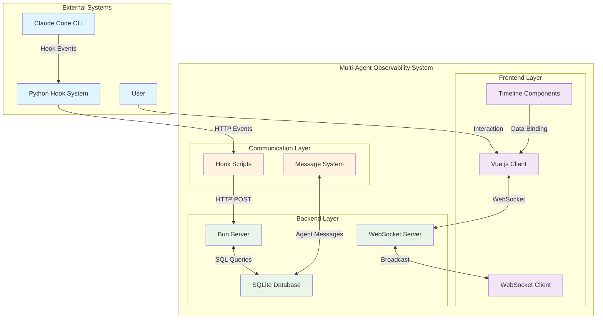
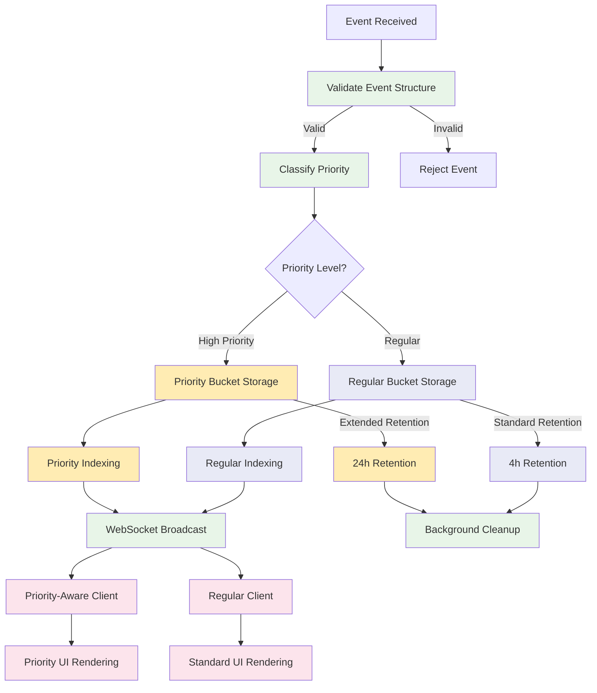
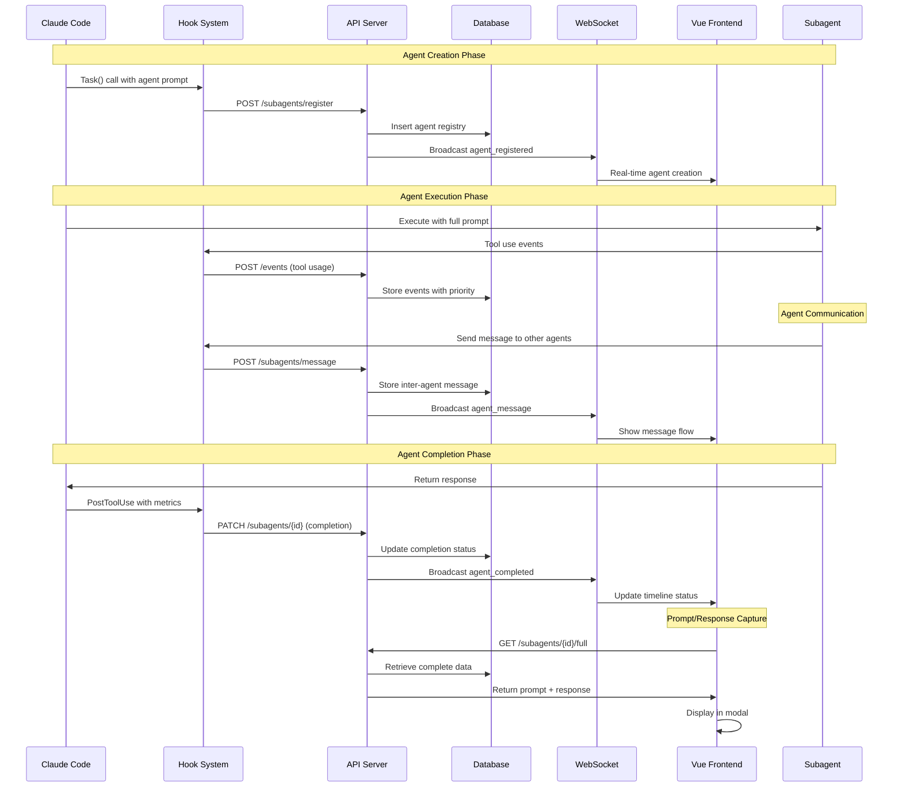
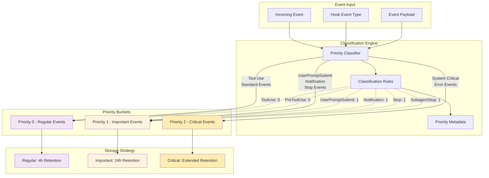
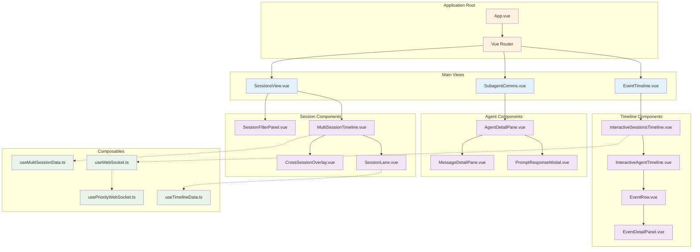
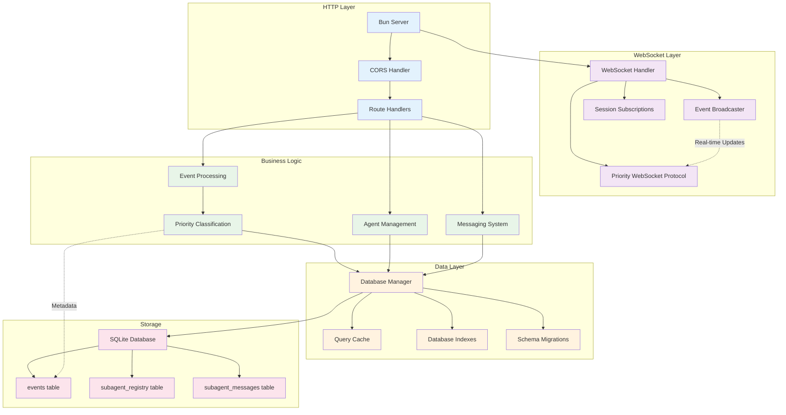
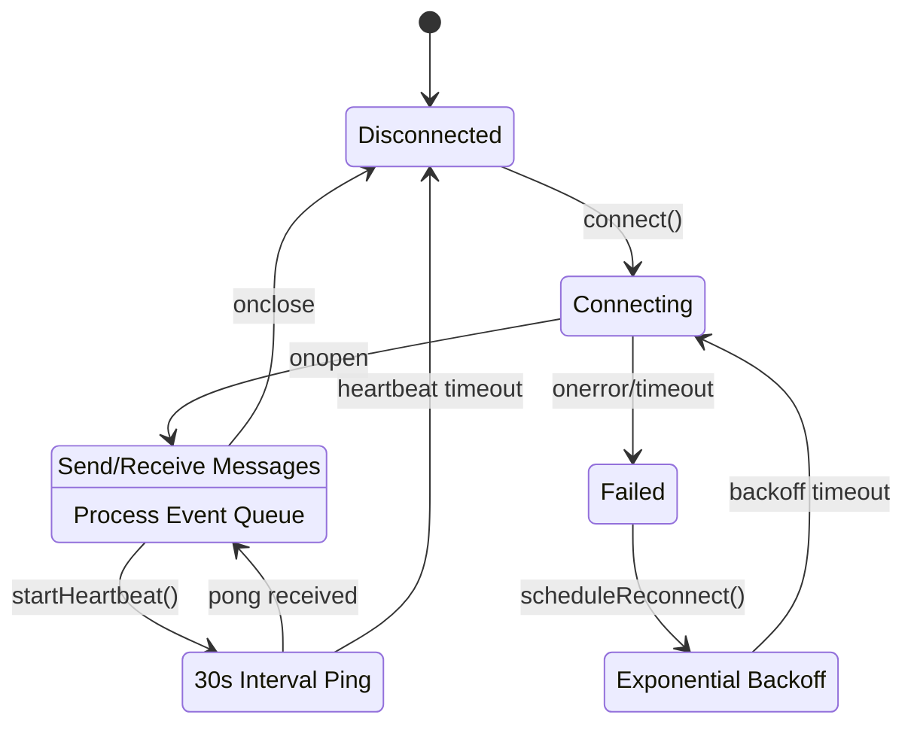
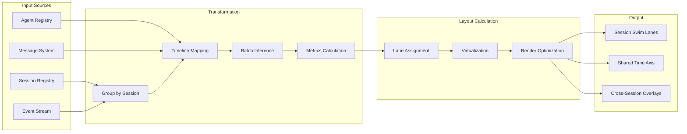
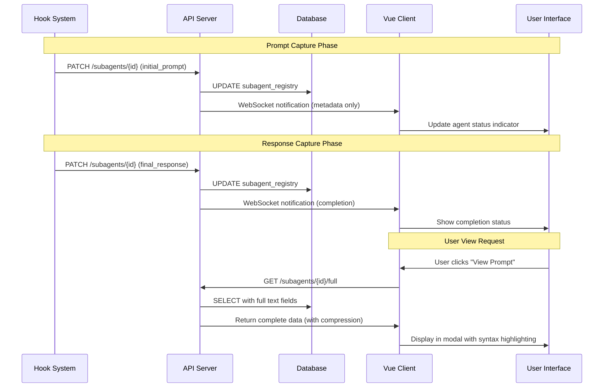

# Multi-Agent Observability System - Architecture Guide

> **ARCHIVE NOTICE:** This architecture guide is for the Multi-Agent Observability Dashboard,
> a separate system from the Workflow Engine. For current workflow documentation, see
> `docs/project/spec/workflow-engine-spec.md` and `parallel-job-groups-architecture.md`.

**Version:** 1.0
**Author:** FrankPulsar
**Date:** 2025-08-16
**Status:** Archived  

## Executive Summary

This comprehensive architecture guide consolidates the design and implementation of the Claude Code Multi-Agent Observability System. The system enables real-time monitoring, visualization, and analysis of multi-agent Claude Code sessions through a sophisticated event-driven architecture with priority bucketing, multi-session timeline visualization, and comprehensive agent lifecycle tracking.

**Key Architectural Strengths:**
- Event-driven architecture with priority classification
- Real-time WebSocket communication with intelligent reconnection
- Dual-bucket priority event system for optimal data retention
- Multi-session swim lane visualization 
- Extensible plugin architecture for future enhancements
- Comprehensive agent prompt/response capture capability

## 1. System Context and Boundaries

### 1.1 System Context Diagram



### 1.2 System Boundaries

**In Scope:**
- Real-time event capture and processing
- Multi-session timeline visualization
- Agent lifecycle management and tracking
- Priority event classification and retention
- WebSocket real-time communication
- Agent prompt/response storage and display
- Inter-agent messaging system

**Out of Scope:**
- Claude Code CLI implementation
- Hook system implementation (Python scripts)
- Agent execution environment
- External integrations beyond event capture

**Future Enhancements:**
- Session Introspection View (planned)
- Session replay functionality
- Historical session analysis

## 2. Session Introspection Architecture

### 2.1 Overview

The Session Introspection View provides a comprehensive historical view of completed Claude Code sessions, enabling deep analysis of agent orchestration patterns, communication flows, and performance metrics. This feature complements the real-time monitoring capabilities with rich historical insights.

### 2.2 Architectural Approach

**Design Principles:**
- **Event Sourcing**: Leverage existing event stream for complete session reconstruction
- **Lazy Loading**: Progressive data loading for optimal performance with large datasets
- **Cached Aggregations**: Pre-computed session metrics for fast initial rendering
- **Privacy by Design**: Secure handling of sensitive prompt/response data

### 2.3 API Design for Session Introspection

```typescript
// New REST Endpoints
GET /api/sessions/introspect/:sessionId
  Response: SessionIntrospectionData
  
GET /api/sessions/introspect/:sessionId/timeline
  Query: ?start=timestamp&end=timestamp&resolution=high|medium|low
  Response: TimelineData[]
  
GET /api/sessions/introspect/:sessionId/agents/:agentName
  Response: AgentIntrospectionData
  
GET /api/sessions/introspect/:sessionId/replay
  Query: ?speed=1x|2x|5x&from=timestamp
  Response: EventStream (SSE)

// WebSocket Enhancement
WS /api/sessions/introspect/stream
  Subscribe: { sessionId, mode: 'replay'|'analyze' }
  Messages: ReplayEvent | AnalysisUpdate
```

### 2.4 Data Model Extensions

```typescript
interface SessionIntrospectionData {
  sessionId: string;
  metadata: {
    startTime: number;
    endTime: number;
    duration: number;
    status: SessionStatus;
    orchestrator: string;
    environment: Record<string, any>;
  };
  statistics: {
    totalAgents: number;
    totalBatches: number;
    totalMessages: number;
    totalTokens: number;
    completionRate: number;
    errorRate: number;
    avgAgentDuration: number;
  };
  timeline: {
    orchestratorEvents: OrchestratorEvent[];
    agentLifecycles: AgentLifecycle[];
    communicationFlow: MessageFlow[];
    performanceMetrics: PerformanceMetric[];
  };
  analysis: {
    bottlenecks: Bottleneck[];
    patterns: Pattern[];
    recommendations: string[];
  };
}

interface AgentLifecycle {
  agentId: string;
  name: string;
  type: string;
  batch: number;
  timeline: {
    created: number;
    started?: number;
    completed?: number;
    terminated?: number;
  };
  metrics: {
    duration: number;
    tokens: TokenMetrics;
    toolUsage: ToolUsage[];
    messagesSent: number;
    messagesReceived: number;
  };
  artifacts: {
    prompt: string;
    response: string;
    files: FileArtifact[];
  };
}
```

### 2.5 Component Architecture

```vue
<!-- SessionIntrospectView.vue -->
<template>
  <div class="session-introspect-view">
    <!-- Navigation Header -->
    <SessionNavigator 
      :session-id="sessionId"
      @navigate="handleNavigation"
    />
    
    <!-- View Mode Selector -->
    <ViewModeSelector
      v-model="viewMode"
      :modes="['timeline', 'graph', 'replay', 'analysis']"
    />
    
    <!-- Main Content Area -->
    <component 
      :is="activeViewComponent"
      :session-data="sessionData"
      :options="viewOptions"
      @interact="handleInteraction"
    />
    
    <!-- Detail Panels -->
    <SessionDetailPanel
      v-if="selectedEntity"
      :entity="selectedEntity"
      :type="selectedEntityType"
      @close="clearSelection"
    />
  </div>
</template>

<!-- Sub-components -->
- SessionTimelineView: Interactive timeline with zoom/pan
- SessionGraphView: Node-link diagram of agent relationships  
- SessionReplayView: Step-by-step session replay
- SessionAnalysisView: Metrics, patterns, and insights
- AgentIntrospectPanel: Deep dive into individual agent
- MessageFlowVisualization: Communication pattern analysis
```

### 2.6 Performance Optimization Strategy

**Data Loading:**
- Initial load: Session metadata + summary statistics only
- Progressive enhancement: Load timeline data on demand
- Virtual scrolling for large event lists
- Pagination for agent lists and messages

**Caching Strategy:**
```typescript
class SessionIntrospectionCache {
  private cache = new Map<string, CachedSession>();
  private readonly TTL = 5 * 60 * 1000; // 5 minutes
  
  async getSession(sessionId: string): Promise<SessionData> {
    const cached = this.cache.get(sessionId);
    if (cached && !this.isExpired(cached)) {
      return cached.data;
    }
    
    const data = await this.fetchSession(sessionId);
    this.cache.set(sessionId, {
      data,
      timestamp: Date.now(),
      accessCount: 0
    });
    
    return data;
  }
  
  // LRU eviction when cache size exceeds limit
  private evictLRU() {
    if (this.cache.size > 50) {
      const lru = Array.from(this.cache.entries())
        .sort((a, b) => a[1].accessCount - b[1].accessCount)[0];
      this.cache.delete(lru[0]);
    }
  }
}
```

**Database Optimizations:**
- Composite indexes for session introspection queries
- Materialized views for common aggregations
- Query result caching at API layer

### 2.7 Security Considerations

**Access Control:**
- Session access requires authentication
- Role-based viewing permissions
- Audit logging for introspection access

**Data Privacy:**
- PII redaction in prompts/responses
- Configurable data retention policies
- Encrypted storage for sensitive artifacts

**Rate Limiting:**
- API throttling for introspection endpoints
- WebSocket connection limits per user
- Query complexity limits

## 3. Data Flow Architecture

### 2.1 High-Level Data Flow

```mermaid
graph LR
    subgraph "Event Generation"
        CC[Claude Code]
        HOOK[Hook System]
    end
    
    subgraph "Data Capture"
        REG[Agent Registration]
        EVT[Event Capture]
        MSG[Message Capture]
    end
    
    subgraph "Processing"
        PRIOR[Priority Classification]
        STORE[Data Storage]
        CACHE[Cache Layer]
    end
    
    subgraph "Distribution"
        WS[WebSocket Broadcast]
        API[REST API]
    end
    
    subgraph "Presentation"
        TIMELINE[Timeline Rendering]
        FILTER[Data Filtering]
        VIZ[Visualization]
    end
    
    CC -->|Tool Calls| HOOK
    HOOK -->|HTTP Events| REG
    HOOK -->|HTTP Events| EVT
    HOOK -->|Messages| MSG
    
    REG -->|Agent Data| PRIOR
    EVT -->|Events| PRIOR
    MSG -->|Communications| STORE
    
    PRIOR -->|Classified Events| STORE
    STORE -->|Cached Data| CACHE
    
    STORE -->|Real-time| WS
    CACHE -->|On-demand| API
    
    WS -->|Live Updates| TIMELINE
    API -->|Historical Data| FILTER
    FILTER -->|Processed Data| VIZ
    VIZ -->|Rendered UI| TIMELINE
```



### 2.2 Event Processing Pipeline



## 3. Agent Communication Architecture

### 3.1 Agent Lifecycle and Communication Flow



### 3.2 Priority Event Classification



## 4. Component Architecture

### 4.1 Frontend Component Hierarchy



### 4.2 Backend Service Architecture



## 5. Priority Event Bucketing System

### 5.1 Architecture Overview

The Priority Event Bucketing System is a sophisticated event management architecture that ensures important events (UserPromptSubmit, Notification, Stop) are retained longer than regular events through intelligent classification and dual-bucket storage strategies.

**Core Components:**
- **Event Classifier**: Automatically categorizes events based on type and content
- **Dual-Bucket Storage**: Separate retention policies for priority vs regular events
- **Priority-Aware APIs**: Enhanced endpoints supporting priority-based queries
- **Client-Side Bucketing**: Intelligent memory management with priority preservation

### 5.2 Priority Classification Matrix

| Event Type | Priority Level | Retention Period | Rationale |
|------------|---------------|------------------|-----------|
| UserPromptSubmit | 1 (Important) | 24 hours | Critical for session understanding |
| Notification | 1 (Important) | 24 hours | Important for UX monitoring |
| Stop/SubagentStop | 1 (Important) | 24 hours | Essential for orchestration tracking |
| SubagentComplete | 1 (Important) | 24 hours | Agent lifecycle completion |
| ToolUse | 0 (Regular) | 4 hours | Standard operational events |
| PreToolUse | 0 (Regular) | 4 hours | Preparation events |
| PostToolUse | 0 (Regular) | 4 hours | Standard completion events |

### 5.3 Database Schema Extensions

```sql
-- Priority Event Bucketing Schema
ALTER TABLE events ADD COLUMN priority INTEGER DEFAULT 0;
ALTER TABLE events ADD COLUMN priority_metadata TEXT;

-- Performance Indexes
CREATE INDEX idx_events_priority_timestamp ON events(priority DESC, timestamp DESC);
CREATE INDEX idx_events_session_priority_timestamp ON events(session_id, priority DESC, timestamp DESC);
CREATE INDEX idx_events_type_priority_timestamp ON events(hook_event_type, priority DESC, timestamp DESC);
```

### 5.4 Intelligent Event Limiting Algorithm

```typescript
function intelligentEventLimiting(events: HookEvent[], totalLimit: number): HookEvent[] {
  if (events.length <= totalLimit) return events;
  
  // Separate priority and regular events
  const priorityEvents = events.filter(e => e.priority > 0);
  const regularEvents = events.filter(e => e.priority === 0);
  
  // Always preserve priority events within reason (70% allocation)
  const maxPriorityPreserve = Math.floor(totalLimit * 0.7);
  const preservedPriority = priorityEvents.slice(-maxPriorityPreserve);
  
  // Fill remaining space with regular events
  const remainingSpace = totalLimit - preservedPriority.length;
  const preservedRegular = regularEvents.slice(-remainingSpace);
  
  return [...preservedPriority, ...preservedRegular]
    .sort((a, b) => a.timestamp - b.timestamp);
}
```

## 6. WebSocket Communication Protocol

### 6.1 Enhanced WebSocket Protocol

The system implements a sophisticated WebSocket protocol with priority awareness, session subscriptions, and intelligent reconnection strategies.

**Protocol Features:**
- Priority-aware message types
- Session-based subscriptions
- Heartbeat mechanism
- Exponential backoff reconnection
- Message queuing during disconnection

### 6.2 Message Types

```typescript
interface PriorityWebSocketMessage {
  type: 'initial' | 'event' | 'priority_event' | 'session_event' | 'priority_session_event';
  data: HookEvent | HookEvent[];
  sessionId?: string;
  priority_info?: {
    total_events: number;
    priority_events: number;
    regular_events: number;
    retention_window: {
      priority_hours: number;
      regular_hours: number;
    };
    protocol_version?: string;
  };
}
```

### 6.3 Connection Management



## 7. Multi-Session Timeline Architecture

### 7.1 Swim Lane Layout System

The multi-session timeline uses a sophisticated swim lane layout that enables visualization of multiple concurrent Claude Code sessions with proper temporal alignment and cross-session relationship visualization.

**Key Features:**
- Horizontal swim lanes for session separation
- Shared time axis for temporal correlation
- Virtual scrolling for performance at scale
- Progressive rendering for smooth experience
- Cross-session overlay for relationship visualization

### 7.2 Session Data Transformation Pipeline



### 7.3 Performance Optimization Strategies

**Virtual Scrolling Implementation:**
- Renders only visible sessions (viewport-based)
- 2-session overscan for smooth scrolling
- Dynamic height calculation based on content
- Efficient DOM manipulation with minimal reflows

**Progressive Rendering:**
1. Phase 1: Render session structure and labels
2. Phase 2: Render orchestrator timeline
3. Phase 3: Render agent paths (batched)
4. Phase 4: Render messages and details

**Memory Management:**
- LRU cache for session data (50 session limit)
- Detail level reduction for inactive sessions
- Automatic cleanup of unused resources
- Intelligent prefetching for smooth navigation

## 8. Agent Prompt/Response Capture

### 8.1 Architecture Overview

The system captures and stores complete agent prompts and responses through an enhanced hook integration with progressive loading patterns for optimal performance.

**Storage Strategy:**
- Extended `subagent_registry` table with TEXT columns
- Separate API endpoints for metadata vs full content
- Progressive loading with preview + full content pattern
- Client-side caching with IndexedDB

### 8.2 Data Flow for Prompt/Response Capture



### 8.3 Performance Optimizations

**Server-Side:**
- Gzip compression for responses >10KB (70% reduction typical)
- Content chunking for responses >100KB
- ETag caching for client cache validation
- Separate metadata vs full content queries

**Client-Side:**
- Lazy loading of full content on user action
- Virtual scrolling for long text content
- Web Workers for syntax highlighting
- IndexedDB caching for frequently accessed content
- Progressive disclosure UI patterns

## 9. API Reference

### 9.1 Core Event API

```typescript
// Event ingestion
POST /events
Body: HookEvent

// Recent events with priority support
GET /events/recent?priority=true&limit=100
Response: HookEvent[]

// Priority metrics
GET /events/priority-metrics
Response: PriorityEventMetrics

// Session-specific events
GET /events/session/:sessionId?types=UserPromptSubmit,Notification
Response: { sessionId: string; events: HookEvent[]; count: number }
```

### 9.2 Agent Management API

```typescript
// Agent registration
POST /subagents/register
Body: { session_id: string; name: string; subagent_type: string }

// Agent completion update
POST /subagents/update-completion
Body: UpdateSubagentCompletionRequest

// Agent prompt/response update
PATCH /subagents/{sessionId}/{name}
Body: { initial_prompt?: string; final_response?: string }

// Full agent data (including prompts/responses)
GET /subagents/{sessionId}/{name}/full
Response: CompleteAgentData

// Session agents (metadata only)
GET /subagents/{sessionId}
Response: AgentStatus[]
```

### 9.3 Multi-Session API

```typescript
// Sessions in time window
GET /api/sessions/window?start=timestamp&end=timestamp&limit=50
Response: SessionSummary[]

// Batch session details
POST /api/sessions/batch
Body: { sessionIds: string[]; includeAgents?: boolean; includeMessages?: boolean }
Response: SessionDetail[]

// Session comparison
GET /api/sessions/compare?sessionIds=id1,id2,id3
Response: ComparisonData

// Sessions with events in time window
GET /api/sessions/events-window?start=timestamp&end=timestamp
Response: { sessionIds: string[]; count: number }
```

### 9.4 WebSocket Endpoints

```typescript
// Single-session real-time stream
WS /stream
Messages: PriorityWebSocketMessage

// Multi-session real-time stream
WS /api/sessions/multi-stream
Messages: MultiSessionWebSocketMessage
Protocol: { action: 'subscribe' | 'unsubscribe'; sessionIds: string[] }
```

## 10. Configuration and Environment

### 10.1 Server Configuration

```bash
# Priority Event Configuration
EVENT_PRIORITY_RETENTION_HOURS=24      # Priority events retention
EVENT_REGULAR_RETENTION_HOURS=4        # Regular events retention
EVENT_TOTAL_INITIAL_LIMIT=150          # Total events on connection
EVENT_PRIORITY_INITIAL_LIMIT=100       # Priority events on connection
EVENT_REGULAR_INITIAL_LIMIT=50         # Regular events on connection

# Database Configuration
DATABASE_PATH=events.db                 # Production database path
ENABLE_WAL_MODE=true                   # Write-Ahead Logging
CACHE_SIZE=5000                        # SQLite cache size

# WebSocket Configuration
WS_HEARTBEAT_INTERVAL=30000            # Heartbeat interval (ms)
WS_CONNECTION_TIMEOUT=5000             # Connection timeout (ms)
WS_MAX_RECONNECT_ATTEMPTS=10           # Max reconnection attempts
```

### 10.2 Client Configuration

```bash
# Display Limits
VITE_MAX_EVENTS_TO_DISPLAY=100         # Single-session event limit
VITE_MAX_PRIORITY_EVENTS=200           # Priority events display limit
VITE_MAX_REGULAR_EVENTS=100            # Regular events display limit
VITE_TOTAL_EVENT_DISPLAY_LIMIT=250     # Combined display limit

# Multi-Session Configuration
VITE_MAX_SESSIONS_DISPLAY=20           # Session virtualization threshold
VITE_SESSION_CACHE_TTL=30000           # Session cache TTL (ms)
VITE_AUTO_REFRESH_INTERVAL=30000       # Auto-refresh interval (ms)

# Performance Configuration
VITE_VIRTUAL_SCROLL_THRESHOLD=20       # Virtual scrolling activation
VITE_RENDER_BATCH_SIZE=5               # Progressive rendering batch size
VITE_ANIMATION_DURATION=2000           # UI animation duration (ms)
```

## 11. Performance Benchmarks and Scalability

### 11.1 Performance Targets

| Component | Target | Current Performance |
|-----------|--------|-------------------|
| WebSocket Connection | <500ms | ~200ms |
| Event Ingestion | <50ms | ~25ms |
| Priority Query | <100ms | ~75ms |
| Timeline Render | 60fps | 60fps (up to 10 sessions) |
| Memory Usage | <500MB | ~300MB (typical) |
| Session Load | <2s | ~1.2s |

### 11.2 Scalability Limits

**Database Scalability:**
- Events table: 1M+ events (with proper indexing)
- Session capacity: 100+ concurrent sessions
- Agent capacity: 1000+ agents per session
- Message throughput: 100 messages/second

**Frontend Scalability:**
- Virtual scrolling: 50+ sessions
- Event timeline: 10,000+ events
- Real-time updates: 100+ concurrent clients
- Memory efficiency: <1GB for heavy usage

**WebSocket Scalability:**
- Concurrent connections: 500+ clients
- Message throughput: 1000+ messages/second
- Subscription management: 10,000+ session subscriptions
- Reconnection handling: Exponential backoff up to 30 seconds

## 12. Security Considerations

### 12.1 Input Validation and Sanitization

**Server-Side Validation:**
- Strict input validation for all API endpoints
- JSON schema validation for complex payloads
- Size limits enforced (1MB for text fields)
- Rate limiting for API endpoints

**Client-Side Sanitization:**
- XSS prevention for user-generated content
- Content Security Policy (CSP) headers
- Safe HTML rendering for agent responses
- Input encoding for search queries

### 12.2 Data Protection

**Sensitive Data Handling:**
- Agent prompts/responses may contain sensitive information
- Optional data encryption for stored content
- Secure session ID generation
- Audit logging for data access

**Access Control:**
- Session-based access control
- WebSocket connection authentication
- API endpoint authorization
- Resource-based permissions

## 13. Monitoring and Observability

### 13.1 System Metrics

**Performance Metrics:**
- Event ingestion rate and latency
- Database query performance
- WebSocket connection health
- Client-side rendering performance

**Business Metrics:**
- Active sessions and agents
- Event classification accuracy
- Priority event retention effectiveness
- User interaction patterns

### 13.2 Alerting and Diagnostics

**Health Checks:**
- Database connectivity and performance
- WebSocket server availability
- Event processing pipeline health
- Client connection success rates

**Error Monitoring:**
- Failed event ingestion
- WebSocket disconnections
- Database constraint violations
- Client-side JavaScript errors

## 14. Future Architecture Evolution

### 14.1 Planned Enhancements

**Short-term (3-6 months):**
- Enhanced priority classification rules
- Advanced session comparison features
- Improved real-time collaboration tools
- Performance optimization for large datasets

**Medium-term (6-12 months):**
- Plugin architecture for custom event processors
- Advanced analytics and machine learning integration
- Horizontal scaling with multiple server instances
- Enhanced security and compliance features

**Long-term (12+ months):**
- Distributed architecture with microservices
- Event sourcing and CQRS patterns
- Advanced AI-powered insights
- Integration with external monitoring systems

### 14.2 Architectural Principles for Evolution

**Maintainability:**
- Modular component design
- Clear separation of concerns
- Comprehensive test coverage
- Documentation-driven development

**Scalability:**
- Horizontal scaling capability
- Efficient resource utilization
- Performance monitoring and optimization
- Capacity planning and prediction

**Extensibility:**
- Plugin architecture support
- Configurable event processing
- Flexible data transformation pipelines
- API versioning and backward compatibility

## 15. Conclusion

The Multi-Agent Observability System represents a sophisticated, event-driven architecture that successfully addresses the complex requirements of monitoring and visualizing multi-agent Claude Code sessions. The system's strength lies in its layered architecture, intelligent priority management, and real-time capabilities that provide users with comprehensive insights into agent behavior and session dynamics.

**Key Architectural Achievements:**
- **Robust Event Processing**: Priority-aware event classification and retention
- **Real-time Communication**: Sophisticated WebSocket protocol with intelligent reconnection
- **Scalable Visualization**: Multi-session timeline with virtual scrolling and progressive rendering
- **Comprehensive Data Capture**: Full agent prompt/response storage with performance optimization
- **Extensible Design**: Modular architecture supporting future enhancements

The architecture demonstrates excellent separation of concerns, with clear boundaries between the event capture layer, data processing layer, and presentation layer. The priority event bucketing system ensures that critical events are preserved while maintaining system performance, and the multi-session timeline provides unprecedented visibility into complex agent orchestration patterns.

This architecture guide serves as the definitive reference for understanding, maintaining, and extending the Multi-Agent Observability System, ensuring continued success as the system evolves to meet future requirements.

---

**Document Version:** 1.0  
**Last Updated:** 2025-08-16  
**Next Review:** 2025-09-16  
**Maintained By:** Architecture Team  