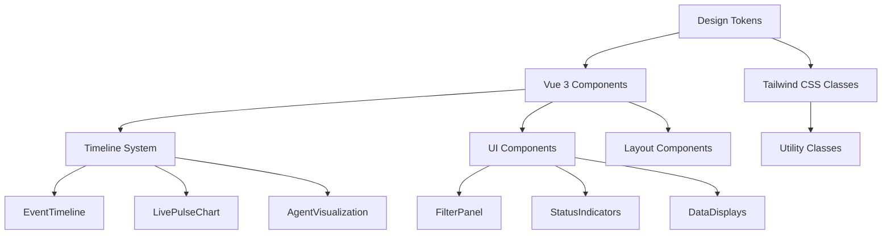

# Design System Guide

## Table of Contents

1. [Overview](#overview)
2. [Design Principles](#design-principles)
3. [Design Tokens](#design-tokens)
4. [Component Architecture](#component-architecture)
5. [Timeline Visualization System](#timeline-visualization-system)
6. [UI Component Library](#ui-component-library)
7. [Layout & Spacing](#layout--spacing)
8. [Typography System](#typography-system)
9. [Color System](#color-system)
10. [Animation & Transitions](#animation--transitions)
11. [Responsive Design](#responsive-design)
12. [Accessibility Guidelines](#accessibility-guidelines)
13. [Vue 3 Integration Patterns](#vue-3-integration-patterns)
14. [Implementation Examples](#implementation-examples)
15. [Performance Considerations](#performance-considerations)

## Overview

The Multi-Agent Observability Design System provides a comprehensive UI framework built on Vue 3 and Tailwind CSS. This guide consolidates all design documentation, component specifications, and implementation patterns into a single reference.

### Key Features

- **Unified Visual Language**: Consistent design tokens and component patterns
- **Timeline Visualization**: Advanced bezier curve agent timeline system
- **Real-time Monitoring**: Live data visualization components
- **Accessibility First**: WCAG 2.1 AA compliant components
- **Performance Optimized**: 60fps animations and efficient rendering
- **Responsive Design**: Mobile-first approach with adaptive layouts

### Architecture



## Design Principles

### 1. Clarity & Hierarchy
- Clear visual hierarchy with distinct information layers
- Primary elements (orchestrator, active agents) get highest visual weight
- Secondary elements (completed agents, messages) use reduced emphasis
- Tertiary elements (backgrounds, grids) provide subtle context

### 2. Real-time Responsiveness
- Immediate feedback for all user interactions
- Smooth 60fps animations for state transitions
- Progressive enhancement for complex visualizations
- Graceful degradation for reduced motion preferences

### 3. Data Density & Readability
- High information density without overwhelming users
- Smart use of color, typography, and spacing for readability
- Progressive disclosure of detailed information
- Context-aware detail levels based on zoom and viewport

### 4. Accessibility & Inclusion
- WCAG 2.1 AA compliance across all components
- High contrast mode support
- Reduced motion preferences respected
- Keyboard navigation and screen reader support

## Design Tokens

### Core Token System

The design system uses a structured token hierarchy for consistent theming and customization:

```typescript
interface DesignTokens {
  colors: ColorSystem;
  spacing: SpacingSystem;
  typography: TypographySystem;
  animation: AnimationSystem;
  shadows: ShadowSystem;
  zIndex: ZIndexSystem;
}
```

### Color Tokens

```json
{
  "colors": {
    "surface": {
      "primary": "#1f2937",
      "elevated": "#374151",
      "elevated-hover": "#4b5563"
    },
    "border": {
      "subtle": "rgba(255,255,255,0.08)",
      "default": "rgba(255,255,255,0.12)",
      "emphasis": "rgba(255,255,255,0.16)"
    },
    "text": {
      "primary": "#e5e7eb",
      "secondary": "#9ca3af",
      "muted": "#6b7280",
      "inverse": "#111827"
    },
    "status": {
      "pending": "#a78bfa",
      "running": "#38bdf8", 
      "completed": "#34d399",
      "error": "#f87171",
      "paused": "#fbbf24",
      "warning": "#fb7185"
    },
    "agents": {
      "architect": "#ec4899",
      "engineer": "#22c55e",
      "tester": "#eab308", 
      "reviewer": "#a855f7",
      "verifier": "#10b981",
      "planner": "#ef4444",
      "analyst": "#14b8a6",
      "researcher": "#6366f1",
      "designer": "#f97316",
      "orchestrator": "#00d4ff"
    }
  }
}
```

### Spacing & Layout Tokens

```json
{
  "spacing": {
    "xs": "4px",
    "sm": "6px", 
    "md": "8px",
    "lg": "12px",
    "xl": "16px",
    "2xl": "20px",
    "3xl": "24px"
  },
  "layout": {
    "orchestrator-y": "80px",
    "lane-height": "60px",
    "batch-separation": "20px",
    "timeline-padding": "16px"
  }
}
```

### Animation Tokens

```json
{
  "animation": {
    "duration": {
      "fast": "150ms",
      "medium": "300ms", 
      "slow": "500ms",
      "spawn": "400ms",
      "completion": "1500ms"
    },
    "easing": {
      "ease-out": "cubic-bezier(0, 0, 0.2, 1)",
      "ease-in-out": "cubic-bezier(0.4, 0, 0.2, 1)",
      "bounce": "cubic-bezier(0.68, -0.55, 0.265, 1.55)"
    }
  }
}
```

## Component Architecture

### Composition Pattern

The design system follows Vue 3's composition API patterns with reusable composables:

```typescript
// useEventColors.ts - Color management composable
export function useEventColors() {
  const getGradientForSession = (sessionId: string): string => {
    const colors = ['bg-gradient-to-r from-blue-500 to-blue-600', /* ... */];
    return colors[sessionId.charCodeAt(0) % colors.length];
  };
  
  const getColorForSession = (sessionId: string): string => {
    const colors = ['text-blue-400', 'text-green-400', /* ... */];
    return colors[sessionId.charCodeAt(0) % colors.length];
  };
  
  return { getGradientForSession, getColorForSession };
}
```

### Component Hierarchy

```
App.vue
├── Header (navigation & status)
├── TabNavigation 
│   ├── EventTimeline
│   │   ├── TimelineDirectionHeader
│   │   ├── EnhancedEventRow
│   │   └── TimelineFlowMarkers
│   ├── SubagentComms
│   │   ├── AgentDetailPane
│   │   └── MessageDetailPane
│   └── SessionsView
│       ├── SessionFilterPanel
│       └── InteractiveSessionsTimeline
├── FilterPanel
├── LivePulseChart
└── UtilityComponents
    ├── StickScrollButton
    └── PerformanceMonitor
```

## Timeline Visualization System

### Core Components

#### EventTimeline.vue
The primary timeline visualization component featuring:

- **Enhanced Event Rows**: Rich event display with temporal context
- **Timeline Direction Control**: Newest-first or oldest-first ordering
- **Smart Scrolling**: Auto-scroll behavior with user control
- **Performance Optimization**: GPU acceleration for smooth rendering

```vue
<template>
  <div class="timeline-container">
    <TimelineDirectionHeader
      :current-order="currentOrder"
      :event-count="events.length"
      @order-changed="handleOrderChange"
    />
    
    <div class="timeline-view" ref="scrollContainer">
      <TransitionGroup name="event" tag="div">
        <EnhancedEventRow
          v-for="event in enhancedEvents"
          :key="event.id"
          :enhanced-event="event"
          :current-order="currentOrder"
        />
      </TransitionGroup>
    </div>
  </div>
</template>
```

#### LivePulseChart.vue
Real-time activity visualization featuring:

- **Time Range Selection**: 1m, 3m, 5m activity windows
- **Interactive Tooltips**: Detailed event breakdowns
- **Responsive Canvas**: High-DPI display support
- **Accessibility**: Screen reader support and keyboard navigation

```vue
<template>
  <div class="pulse-chart-container">
    <div class="chart-controls">
      <button
        v-for="range in timeRanges"
        :key="range"
        @click="setTimeRange(range)"
        :class="['time-range-button', { active: timeRange === range }]"
      >
        {{ range }}
      </button>
    </div>
    
    <canvas
      ref="canvas"
      class="pulse-chart"
      @mousemove="handleMouseMove"
      :aria-label="chartAriaLabel"
    ></canvas>
  </div>
</template>
```

### Timeline Animation System

The timeline uses CSS custom properties for dynamic animations:

```css
.event-enter-active {
  transition: all 300ms cubic-bezier(0.4, 0, 0.2, 1);
}

.event-enter-from {
  opacity: 0;
  transform: translateY(var(--enter-direction, -20px)) scale(0.95);
}

/* Direction-aware animations */
.timeline-container.newest-first {
  --enter-direction: -20px;
  --leave-direction: 20px;
}

.timeline-container.oldest-first {
  --enter-direction: 20px;
  --leave-direction: -20px;
}
```

### Enhanced Event Row System

Each event row includes multiple information layers:

1. **Base Event Data**: Type, timestamp, source info
2. **Temporal Context**: Position badges (latest, recent, older, oldest)
3. **Flow Markers**: Visual indicators for timeline progression
4. **Interactive Elements**: Hover states and focus management

```vue
<template>
  <div class="enhanced-event-container" :class="positionClass">
    <TimelineFlowMarkers :position="event.position" />
    
    <div class="event-content">
      <EventRow :event="event" />
      <TemporalContextBadge :timestamp="event.timestamp" />
    </div>
  </div>
</template>
```

## UI Component Library

### Core Components

#### FilterPanel.vue
Multi-field filtering interface:

```vue
<template>
  <div class="filter-panel">
    <div class="filter-grid">
      <div class="filter-field">
        <label>Source App</label>
        <select v-model="filters.sourceApp">
          <option value="">All Sources</option>
          <option v-for="app in sourceApps" :value="app">{{ app }}</option>
        </select>
      </div>
      <!-- Additional filter fields -->
    </div>
  </div>
</template>

<style scoped>
.filter-panel {
  @apply bg-gradient-to-r from-gray-800 to-gray-700;
  @apply border-b-2 border-blue-500 px-3 py-4 shadow-lg;
}

.filter-grid {
  @apply flex flex-wrap gap-3 items-center mobile:flex-col;
}

select {
  @apply w-full px-4 py-2 border border-blue-500 rounded-lg;
  @apply focus:ring-2 focus:ring-blue-500/30 focus:border-blue-700;
  @apply bg-gray-800 text-white shadow-md hover:shadow-lg;
  @apply transition-all duration-200;
}
</style>
```

#### Status Indicators
Visual status communication system:

```typescript
// Status configuration
const statusConfig = {
  pending: {
    color: '#a78bfa',
    icon: 'pending',
    label: 'Queued',
    bgClass: 'bg-violet-400/10',
    textClass: 'text-violet-400'
  },
  running: {
    color: '#38bdf8', 
    icon: 'running',
    label: 'Running',
    bgClass: 'bg-sky-400/10',
    textClass: 'text-sky-400'
  }
  // ... additional states
};
```

### Navigation Components

#### Tab System
Accessible tab navigation with visual state management:

```vue
<template>
  <div class="tab-navigation">
    <button
      v-for="tab in tabs"
      :key="tab.id"
      @click="activeTab = tab.id"
      :class="tabClasses(tab.id)"
      :aria-selected="activeTab === tab.id"
      role="tab"
    >
      {{ tab.label }}
    </button>
  </div>
</template>

<style scoped>
.tab-navigation {
  @apply bg-gray-800 border-b border-gray-700;
  @apply flex space-x-1 px-4 py-2;
}

.tab-button {
  @apply px-4 py-2 rounded-t-lg font-semibold transition-all;
}

.tab-button.active {
  @apply bg-gray-900 text-blue-400 border-t-2 border-blue-400;
}

.tab-button.inactive {
  @apply bg-gray-700 text-gray-400 hover:text-white hover:bg-gray-600;
}
</style>
```

## Layout & Spacing

### Grid System

The design system uses CSS Grid and Flexbox for responsive layouts:

```css
/* Main application layout */
.app-layout {
  @apply h-screen flex flex-col bg-gray-900;
}

.app-header {
  @apply bg-gradient-to-r from-blue-600 to-blue-400;
  @apply shadow-lg border-b-2 border-blue-800;
}

.app-content {
  @apply flex-1 overflow-hidden flex flex-col;
}

/* Timeline layout grid */
.timeline-grid {
  display: grid;
  grid-template-rows: auto 1fr;
  grid-template-columns: 1fr;
  height: 100%;
}

/* Component spacing system */
.component-spacing {
  --space-xs: 0.25rem;   /* 4px */
  --space-sm: 0.375rem;  /* 6px */
  --space-md: 0.5rem;    /* 8px */
  --space-lg: 0.75rem;   /* 12px */
  --space-xl: 1rem;      /* 16px */
  --space-2xl: 1.25rem;  /* 20px */
  --space-3xl: 1.5rem;   /* 24px */
}
```

### Mobile-First Responsive Design

```css
/* Base mobile styles */
.responsive-component {
  @apply px-2 py-1.5 text-sm;
}

/* Tablet and desktop */
@media (min-width: 700px) {
  .responsive-component {
    @apply px-3 py-2 text-base;
  }
}

/* Custom mobile utility */
@screen mobile {
  .mobile-optimized {
    @apply flex-col space-y-2 items-stretch;
  }
}
```

## Typography System

### Font Hierarchy

```css
/* Primary text styles */
.text-hierarchy {
  /* Headers */
  --text-h1: 2rem;      /* 32px */
  --text-h2: 1.5rem;    /* 24px */
  --text-h3: 1.25rem;   /* 20px */
  --text-h4: 1.125rem;  /* 18px */
  
  /* Body text */
  --text-lg: 1rem;      /* 16px */
  --text-base: 0.875rem; /* 14px */
  --text-sm: 0.75rem;   /* 12px */
  --text-xs: 0.625rem;  /* 10px */
}

/* Font weights */
.font-weights {
  --font-normal: 400;
  --font-medium: 500;
  --font-semibold: 600;
  --font-bold: 700;
}

/* Line heights */
.line-heights {
  --leading-tight: 1.2;
  --leading-normal: 1.5;
  --leading-relaxed: 1.6;
}
```

### Typography Components

```vue
<!-- Header component -->
<h1 class="text-2xl mobile:text-lg font-bold text-white drop-shadow-lg">
  Multi-Agent Observability
</h1>

<!-- Body text with responsive sizing -->
<p class="text-base mobile:text-sm text-gray-400 leading-normal">
  Event timeline description
</p>

<!-- Monospace for technical data -->
<code class="text-xs font-mono text-blue-400 bg-gray-800 px-2 py-1 rounded">
  agent-id-12345
</code>
```

## Color System

### Semantic Color Usage

```css
/* Status colors */
.status-colors {
  --status-pending: #a78bfa;    /* Purple - waiting state */
  --status-running: #38bdf8;    /* Blue - active state */
  --status-completed: #34d399;  /* Green - success state */
  --status-error: #f87171;      /* Red - error state */
  --status-paused: #fbbf24;     /* Yellow - paused state */
}

/* Agent type colors */
.agent-colors {
  --agent-architect: #ec4899;   /* Pink - design/planning */
  --agent-engineer: #22c55e;    /* Green - implementation */
  --agent-tester: #eab308;      /* Yellow - quality assurance */
  --agent-reviewer: #a855f7;    /* Purple - validation */
  --agent-designer: #f97316;    /* Orange - creative work */
}

/* Surface colors */
.surface-colors {
  --surface-primary: #1f2937;   /* Dark gray - main background */
  --surface-elevated: #374151;  /* Medium gray - elevated surfaces */
  --surface-overlay: rgba(0, 0, 0, 0.9); /* Modal overlays */
}
```

### Color Application Examples

```vue
<!-- Status-based styling -->
<div :class="[
  'status-indicator',
  `status-${agent.status}`,
  statusConfig[agent.status].bgClass
]">
  <span :class="statusConfig[agent.status].textClass">
    {{ statusConfig[agent.status].label }}
  </span>
</div>

<!-- Agent type styling -->
<div 
  class="agent-label"
  :style="{ '--agent-color': getAgentColor(agent.type) }"
>
  {{ agent.name }}
</div>

<style>
.agent-label {
  color: var(--agent-color);
  border: 1px solid color-mix(in srgb, var(--agent-color) 40%, transparent);
  background: color-mix(in srgb, var(--agent-color) 10%, transparent);
}
</style>
```

## Animation & Transitions

### Animation Philosophy

1. **Purposeful Motion**: Every animation serves a functional purpose
2. **Consistent Timing**: Use design tokens for duration and easing
3. **Performance First**: GPU acceleration for complex animations
4. **Accessibility**: Respect reduced motion preferences

### Core Animation Patterns

```css
/* Standard transition */
.smooth-transition {
  transition: all 300ms cubic-bezier(0.4, 0, 0.2, 1);
}

/* Entry animations */
.fade-in-up {
  animation: fadeInUp 400ms cubic-bezier(0.4, 0, 0.2, 1) forwards;
}

@keyframes fadeInUp {
  from {
    opacity: 0;
    transform: translateY(20px);
  }
  to {
    opacity: 1;
    transform: translateY(0);
  }
}

/* Loading states */
.loading-shimmer {
  background: linear-gradient(
    90deg,
    transparent 0%,
    rgba(56, 189, 248, 0.3) 50%,
    transparent 100%
  );
  animation: shimmer 1.5s ease-in-out infinite;
}

@keyframes shimmer {
  0% { transform: translateX(-100%); }
  100% { transform: translateX(200%); }
}
```

### Vue Transition Integration

```vue
<template>
  <TransitionGroup name="event-list" tag="div">
    <div
      v-for="event in events"
      :key="event.id"
      class="event-item"
    >
      {{ event.content }}
    </div>
  </TransitionGroup>
</template>

<style>
.event-list-enter-active {
  transition: all 300ms cubic-bezier(0.4, 0, 0.2, 1);
}

.event-list-enter-from {
  opacity: 0;
  transform: translateY(-20px) scale(0.95);
}

.event-list-leave-active {
  transition: all 200ms ease-in;
}

.event-list-leave-to {
  opacity: 0;
  transform: translateY(20px) scale(0.95);
}
</style>
```

## Responsive Design

### Breakpoint System

```css
/* Custom breakpoints */
@media (max-width: 699px) { /* mobile */ }
@media (min-width: 700px) and (max-width: 1023px) { /* tablet */ }
@media (min-width: 1024px) { /* desktop */ }

/* Tailwind mobile variant */
@responsive {
  .mobile\:flex-col {
    @media (max-width: 699px) {
      flex-direction: column;
    }
  }
}
```

### Component Adaptation

```vue
<template>
  <div class="responsive-header">
    <div class="header-content mobile:flex-col mobile:space-y-2">
      <!-- Logo -->
      <h1 class="text-2xl mobile:text-lg mobile:text-center">
        Multi-Agent Observability
      </h1>
      
      <!-- Status -->
      <div class="status-section mobile:justify-center">
        <StatusIndicator :connected="isConnected" />
        <span class="text-base mobile:text-sm">
          {{ events.length }} events
        </span>
      </div>
      
      <!-- Controls -->
      <div class="controls mobile:w-full mobile:justify-center">
        <button class="p-3 mobile:p-1.5 rounded-lg">
          <span class="text-2xl mobile:text-lg">📊</span>
        </button>
      </div>
    </div>
  </div>
</template>

<style scoped>
.responsive-header {
  @apply bg-gradient-to-r from-blue-600 to-blue-400;
  @apply shadow-lg border-b-2 border-blue-800;
}

.header-content {
  @apply px-3 py-4 mobile:py-2 flex items-center justify-between;
}

.status-section {
  @apply flex items-center space-x-1.5;
}

.controls {
  @apply flex items-center space-x-2;
}
</style>
```

## Accessibility Guidelines

### WCAG 2.1 AA Compliance

#### 1. Color and Contrast
- Minimum contrast ratio of 4.5:1 for normal text
- Minimum contrast ratio of 3:1 for large text and UI components
- Color is not the only means of conveying information

```css
/* High contrast support */
@media (prefers-contrast: high) {
  .status-indicator {
    border-width: 2px;
    font-weight: 700;
  }
  
  .agent-curve {
    stroke-width: 4px;
    filter: none;
  }
}
```

#### 2. Keyboard Navigation
All interactive elements must be keyboard accessible:

```vue
<template>
  <button
    @click="handleClick"
    @keydown.enter="handleClick"
    @keydown.space.prevent="handleClick"
    class="accessible-button"
    :aria-label="buttonAriaLabel"
    :aria-pressed="isActive"
  >
    {{ buttonText }}
  </button>
</template>

<style>
.accessible-button:focus-visible {
  outline: 2px solid #00d4ff;
  outline-offset: 2px;
  box-shadow: 0 0 8px rgba(0, 212, 255, 0.4);
}
</style>
```

#### 3. Screen Reader Support

```vue
<!-- Live regions for dynamic content -->
<div
  aria-live="polite"
  aria-label="Event stream updates"
  class="sr-only"
>
  {{ screenReaderStatus }}
</div>

<!-- Descriptive labels for complex components -->
<div
  role="img"
  :aria-label="chartAriaLabel"
  class="live-pulse-chart"
>
  <canvas ref="chartCanvas"></canvas>
</div>

<!-- Progress indicators -->
<div
  role="progressbar"
  :aria-valuenow="progress"
  aria-valuemin="0"
  aria-valuemax="100"
  :aria-label="`Progress: ${progress}%`"
>
  <div class="progress-bar" :style="{ width: `${progress}%` }"></div>
</div>
```

#### 4. Motion and Animation

```css
/* Respect reduced motion preferences */
@media (prefers-reduced-motion: reduce) {
  *,
  *::before,
  *::after {
    animation-duration: 0.01ms !important;
    animation-iteration-count: 1 !important;
    transition-duration: 0.01ms !important;
  }
  
  /* Maintain essential state indicators */
  .status-indicator.running {
    /* Static pattern instead of animation */
    background: repeating-linear-gradient(
      45deg,
      #38bdf8,
      #38bdf8 4px,
      transparent 4px,
      transparent 8px
    );
  }
}
```

## Vue 3 Integration Patterns

### Composition API Usage

```typescript
// useEventTimeline.ts - Timeline state management
import { ref, computed, watch, onMounted, onUnmounted } from 'vue';
import type { HookEvent } from '@/types';

export function useEventTimeline() {
  // Reactive state
  const events = ref<HookEvent[]>([]);
  const currentOrder = ref<'newest-first' | 'oldest-first'>('newest-first');
  const stickToBottom = ref(true);
  
  // Computed properties
  const sortedEvents = computed(() => {
    const sorted = [...events.value];
    return currentOrder.value === 'newest-first' 
      ? sorted.reverse() 
      : sorted;
  });
  
  // Methods
  const addEvent = (event: HookEvent) => {
    events.value.push(event);
  };
  
  const setOrder = (order: 'newest-first' | 'oldest-first') => {
    currentOrder.value = order;
  };
  
  // Lifecycle
  onMounted(() => {
    // Initialize timeline
  });
  
  onUnmounted(() => {
    // Cleanup
  });
  
  return {
    events,
    currentOrder,
    stickToBottom,
    sortedEvents,
    addEvent,
    setOrder
  };
}
```

### Component Communication Patterns

```typescript
// Event bus for component communication
import { ref } from 'vue';

const eventBus = ref(new Map());

export function useEventBus() {
  const emit = (event: string, data: any) => {
    const handlers = eventBus.value.get(event) || [];
    handlers.forEach((handler: Function) => handler(data));
  };
  
  const on = (event: string, handler: Function) => {
    const handlers = eventBus.value.get(event) || [];
    handlers.push(handler);
    eventBus.value.set(event, handlers);
  };
  
  const off = (event: string, handler: Function) => {
    const handlers = eventBus.value.get(event) || [];
    const index = handlers.indexOf(handler);
    if (index > -1) {
      handlers.splice(index, 1);
      eventBus.value.set(event, handlers);
    }
  };
  
  return { emit, on, off };
}
```

### Prop and Event Patterns

```vue
<!-- Parent Component -->
<template>
  <EventTimeline
    :events="events"
    :filters="filters"
    v-model:stick-to-bottom="stickToBottom"
    @event-selected="handleEventSelection"
    @order-changed="handleOrderChange"
  />
</template>

<!-- Child Component -->
<script setup lang="ts">
// Props with TypeScript
interface Props {
  events: HookEvent[];
  filters: FilterState;
  stickToBottom: boolean;
}

// Events with TypeScript
interface Emits {
  'update:stickToBottom': [value: boolean];
  'event-selected': [event: HookEvent];
  'order-changed': [order: 'newest-first' | 'oldest-first'];
}

const props = defineProps<Props>();
const emit = defineEmits<Emits>();

// Model binding
const localStickToBottom = computed({
  get: () => props.stickToBottom,
  set: (value) => emit('update:stickToBottom', value)
});
</script>
```

## Implementation Examples

### Complete Component Example

```vue
<!-- StatusIndicator.vue -->
<template>
  <div class="status-indicator-container">
    <div 
      class="status-icon"
      :class="statusClasses"
      :aria-label="config.label"
      role="img"
    >
      <div class="status-icon-inner"></div>
    </div>
    <span 
      v-if="showLabel" 
      class="status-label"
      :class="config.textClass"
    >
      {{ config.label }}
    </span>
  </div>
</template>

<script setup lang="ts">
import { computed } from 'vue';

interface Props {
  status: 'pending' | 'running' | 'completed' | 'error' | 'paused';
  showLabel?: boolean;
  size?: 'sm' | 'md' | 'lg';
}

const props = withDefaults(defineProps<Props>(), {
  showLabel: false,
  size: 'md'
});

const statusConfigs = {
  pending: {
    label: 'Pending',
    textClass: 'text-violet-400',
    iconClass: 'bg-violet-400/10 border-violet-400/40'
  },
  running: {
    label: 'Running', 
    textClass: 'text-sky-400',
    iconClass: 'bg-sky-400/10 border-sky-400/40'
  },
  completed: {
    label: 'Completed',
    textClass: 'text-emerald-400', 
    iconClass: 'bg-emerald-400/10 border-emerald-400/40'
  },
  error: {
    label: 'Error',
    textClass: 'text-red-400',
    iconClass: 'bg-red-400/10 border-red-400/40'
  },
  paused: {
    label: 'Paused',
    textClass: 'text-amber-400',
    iconClass: 'bg-amber-400/10 border-amber-400/40'
  }
};

const config = computed(() => statusConfigs[props.status]);

const statusClasses = computed(() => [
  'status-icon-base',
  `status-icon-${props.status}`,
  `status-icon-${props.size}`,
  config.value.iconClass
]);
</script>

<style scoped>
.status-indicator-container {
  @apply flex items-center gap-2;
}

.status-icon-base {
  @apply rounded-full flex items-center justify-center relative;
  @apply border transition-all duration-150 ease-out;
}

.status-icon-sm {
  @apply w-3 h-3;
}

.status-icon-md {
  @apply w-4 h-4;
}

.status-icon-lg {
  @apply w-5 h-5;
}

.status-icon-pending .status-icon-inner {
  @apply w-2 h-2 border border-violet-400 rounded-full;
}

.status-icon-running {
  background: conic-gradient(from 0deg, theme('colors.sky.400') 0 270deg, transparent 270deg 360deg);
  animation: spin 1.2s linear infinite;
}

.status-icon-completed {
  @apply bg-emerald-400 border-emerald-400;
}

.status-icon-completed::after {
  content: '';
  @apply absolute;
  left: 50%;
  top: 50%;
  width: 6px;
  height: 3px;
  border-left: 2px solid #000;
  border-bottom: 2px solid #000;
  transform: translate(-50%, -60%) rotate(-45deg);
}

.status-icon-error {
  @apply bg-red-400 border-red-400;
  clip-path: polygon(50% 0, 100% 50%, 50% 100%, 0 50%);
}

.status-icon-paused {
  @apply bg-amber-400 border-amber-400;
}

.status-icon-paused::before,
.status-icon-paused::after {
  content: '';
  @apply absolute bg-black;
  width: 2px;
  height: 8px;
  top: 50%;
  transform: translateY(-50%);
}

.status-icon-paused::before {
  left: 25%;
}

.status-icon-paused::after {
  right: 25%;
}

.status-label {
  @apply text-xs font-medium;
}

@keyframes spin {
  to { transform: rotate(360deg); }
}

@media (prefers-reduced-motion: reduce) {
  .status-icon-running {
    animation: none;
    background: theme('colors.sky.400');
  }
}
</style>
```

### Utility Function Examples

```typescript
// formatters.ts - Common formatting utilities
export function formatDuration(ms: number): string {
  const seconds = Math.floor(ms / 1000);
  const minutes = Math.floor(seconds / 60);
  const hours = Math.floor(minutes / 60);
  
  if (hours > 0) {
    return `${hours}h ${minutes % 60}m`;
  } else if (minutes > 0) {
    return `${minutes}m ${seconds % 60}s`;
  } else {
    return `${seconds}s`;
  }
}

export function formatTimestamp(timestamp: number): string {
  return new Date(timestamp).toLocaleTimeString();
}

export function truncateText(text: string, maxLength: number): string {
  if (text.length <= maxLength) return text;
  return text.slice(0, maxLength) + '...';
}

// colors.ts - Color manipulation utilities
export function hexToRgba(hex: string, alpha: number): string {
  const r = parseInt(hex.slice(1, 3), 16);
  const g = parseInt(hex.slice(3, 5), 16);
  const b = parseInt(hex.slice(5, 7), 16);
  return `rgba(${r}, ${g}, ${b}, ${alpha})`;
}

export function getContrastColor(hexColor: string): string {
  const r = parseInt(hexColor.slice(1, 3), 16);
  const g = parseInt(hexColor.slice(3, 5), 16);
  const b = parseInt(hexColor.slice(5, 7), 16);
  const luminance = (0.299 * r + 0.587 * g + 0.114 * b) / 255;
  return luminance > 0.5 ? '#000000' : '#ffffff';
}
```

## Performance Considerations

### Optimization Strategies

#### 1. Virtual Scrolling
For large datasets (>100 events):

```typescript
// useVirtualScroll.ts
import { ref, computed, onMounted, onUnmounted } from 'vue';

export function useVirtualScroll(items: Ref<any[]>, itemHeight: number) {
  const scrollContainer = ref<HTMLElement>();
  const scrollTop = ref(0);
  const containerHeight = ref(0);
  
  const visibleRange = computed(() => {
    const start = Math.floor(scrollTop.value / itemHeight);
    const visibleCount = Math.ceil(containerHeight.value / itemHeight);
    const end = Math.min(start + visibleCount + 2, items.value.length);
    
    return { start: Math.max(0, start - 1), end };
  });
  
  const visibleItems = computed(() => {
    const { start, end } = visibleRange.value;
    return items.value.slice(start, end).map((item, index) => ({
      ...item,
      index: start + index
    }));
  });
  
  const totalHeight = computed(() => items.value.length * itemHeight);
  const offsetY = computed(() => visibleRange.value.start * itemHeight);
  
  return {
    scrollContainer,
    visibleItems,
    totalHeight,
    offsetY,
    scrollTop
  };
}
```

#### 2. Animation Performance

```css
/* GPU acceleration for smooth animations */
.gpu-accelerated {
  transform: translateZ(0);
  backface-visibility: hidden;
  perspective: 1000px;
  will-change: transform;
}

/* Optimize for 60fps */
.smooth-animation {
  animation-duration: 300ms;
  animation-timing-function: cubic-bezier(0.4, 0, 0.2, 1);
  animation-fill-mode: both;
}

/* Batch DOM updates */
.batch-updates {
  contain: layout style paint;
}
```

#### 3. Memory Management

```typescript
// Cleanup patterns
onUnmounted(() => {
  // Clear intervals
  if (updateInterval.value) {
    clearInterval(updateInterval.value);
  }
  
  // Remove event listeners
  window.removeEventListener('resize', handleResize);
  
  // Clear large data structures
  chartData.value = null;
  processedEvents.clear();
});

// Debounced updates
const debouncedUpdate = debounce((data: any[]) => {
  processData(data);
}, 300);
```

### Performance Monitoring

```typescript
// usePerformanceMonitor.ts
export function usePerformanceMonitor() {
  const metrics = ref({
    renderTime: 0,
    memoryUsage: 0,
    fps: 0
  });
  
  const measureRender = (callback: () => void) => {
    const start = performance.now();
    callback();
    metrics.value.renderTime = performance.now() - start;
  };
  
  const startFPSMonitor = () => {
    let frames = 0;
    let lastTime = performance.now();
    
    const countFrames = () => {
      frames++;
      const currentTime = performance.now();
      
      if (currentTime - lastTime >= 1000) {
        metrics.value.fps = frames;
        frames = 0;
        lastTime = currentTime;
      }
      
      requestAnimationFrame(countFrames);
    };
    
    requestAnimationFrame(countFrames);
  };
  
  return { metrics, measureRender, startFPSMonitor };
}
```

---

This comprehensive design system guide provides all the documentation, patterns, and implementation details needed to maintain consistency and quality across the Multi-Agent Observability platform. Regular updates to this guide should be made as the system evolves and new patterns emerge.