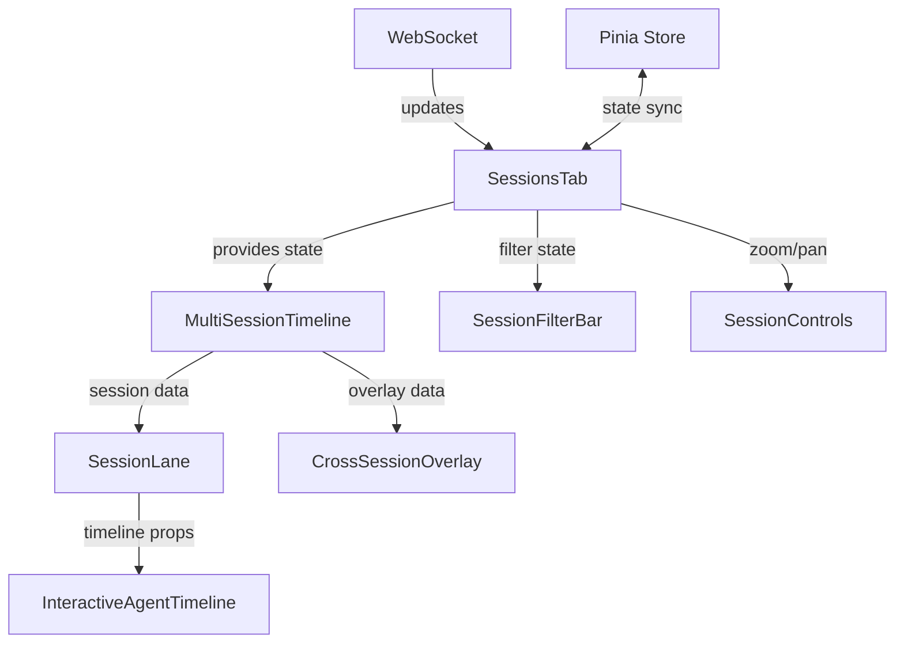

# Sessions Tab Architecture Blueprint

**Author:** SofiaArchitect  
**Date:** 2025-08-13  
**Status:** Complete  
**Version:** 1.0  

## Executive Summary

This architectural blueprint defines the complete technical design for implementing the Sessions tab feature in the Multi-Agent Observability Dashboard. Building upon MarcusAnalyst's findings that the existing timeline architecture is highly modular and extensible, this design leverages the current component structure while introducing minimal new components and patterns.

**Key Architectural Decisions:**
- Extend existing timeline components rather than replacing them
- Implement swim lane layout as primary visualization pattern
- Reuse current data transformation pipeline with session-aware modifications
- Maintain backward compatibility with single-session views
- Optimize for 10+ concurrent sessions with progressive rendering

## 1. Component Architecture

### 1.1 Component Hierarchy

```
App.vue
└── SessionsTab.vue (NEW)
    ├── SessionsHeader.vue (NEW)
    │   ├── TimeWindowSelector
    │   ├── SessionFilterBar
    │   └── ViewModeToggle
    ├── MultiSessionTimeline.vue (NEW)
    │   ├── SessionLane.vue (NEW) [Multiple Instances]
    │   │   └── InteractiveAgentTimeline.vue (EXISTING, Modified)
    │   ├── TimeAxis.vue (NEW, Shared)
    │   ├── SessionLabels.vue (NEW)
    │   └── CrossSessionOverlay.vue (NEW)
    └── SessionControls.vue (NEW)
        ├── ZoomControls (EXISTING)
        ├── PanControls (NEW)
        └── SessionSelector (NEW)
```

### 1.2 Component Responsibilities

#### **SessionsTab.vue** (Root Container)
- **Purpose**: Main container for sessions visualization
- **Responsibilities**:
  - Manage session selection state
  - Coordinate time window across all sessions
  - Handle WebSocket subscriptions for multiple sessions
  - Orchestrate data fetching and updates
- **State Management**: Local component state with provide/inject for child access

#### **MultiSessionTimeline.vue** (Core Visualization)
- **Purpose**: Orchestrates multi-session timeline rendering
- **Responsibilities**:
  - Calculate swim lane positions
  - Manage shared time axis
  - Handle cross-session interactions
  - Virtualize sessions for performance
- **Key Features**:
  - Virtual scrolling for >20 sessions
  - Progressive rendering
  - Shared viewport state

#### **SessionLane.vue** (Session Container)
- **Purpose**: Wrapper for individual session timeline
- **Responsibilities**:
  - Manage lane height (60px min, 200px max)
  - Handle session-specific interactions
  - Display session metadata
  - Control expansion/collapse state
- **Integration**: Wraps existing InteractiveAgentTimeline with session context

#### **CrossSessionOverlay.vue** (Relationship Layer)
- **Purpose**: Visualize cross-session relationships
- **Responsibilities**:
  - Render inter-session message flows
  - Show temporal alignment markers
  - Display comparison overlays
- **Rendering**: SVG overlay using absolute positioning

### 1.3 Modified Existing Components

#### **InteractiveAgentTimeline.vue** Modifications:
```typescript
// New props for multi-session context
interface TimelineProps {
  sessionId: string;
  laneHeight?: number;        // NEW: Constrained height
  showLabels?: boolean;       // NEW: Toggle for space optimization
  simplifiedMode?: boolean;   // NEW: Reduced detail for overview
  laneOffset?: number;        // NEW: Y-axis offset for swim lane
  sharedTimeScale?: any;      // NEW: Shared scale from parent
}
```

## 2. Data Flow Architecture

### 2.1 State Management Pattern

```typescript
// Session State Store (Pinia)
interface SessionsState {
  // Session Data
  sessions: Map<string, SessionData>;
  activeSessions: string[];
  
  // View State
  timeWindow: TimeWindow;
  zoomLevel: number;
  panOffset: { x: number; y: number };
  
  // Selection State
  selectedSessions: Set<string>;
  focusedSession: string | null;
  comparisonMode: boolean;
  
  // Filter State
  filters: SessionFilters;
  
  // Performance State
  virtualizedSessions: Set<string>;
  visibleRange: { start: number; end: number };
}

interface TimeWindow {
  start: number;  // Unix timestamp
  end: number;    // Unix timestamp
  duration: number; // milliseconds
  mode: 'relative' | 'absolute';
}
```

### 2.2 Data Flow Diagram

```
[WebSocket] → [SessionDataService] → [Pinia Store]
                                           ↓
[SessionsTab] ← [Computed State] ← [Transformers]
      ↓
[MultiSessionTimeline] ← [Session Filters]
      ↓
[SessionLane × N] ← [Virtual Scroller]
      ↓
[InteractiveAgentTimeline] ← [Existing Composables]
```

### 2.3 Data Transformation Pipeline

```typescript
// Extended Transform Pipeline for Multi-Session
class MultiSessionTransformPipeline {
  // Input: Raw session data from multiple sources
  transformSessions(
    sessions: RawSessionData[],
    timeWindow: TimeWindow,
    filters: SessionFilters
  ): TransformedSessionData[] {
    return sessions
      .filter(s => this.isInTimeWindow(s, timeWindow))
      .filter(s => this.matchesFilters(s, filters))
      .map(s => this.transformSession(s))
      .sort((a, b) => this.sortByCriteria(a, b));
  }
  
  // Assign swim lanes with overlap prevention
  assignSwimLanes(
    sessions: TransformedSessionData[]
  ): Map<string, SwimLaneAssignment> {
    const assignments = new Map();
    const laneHeight = this.calculateOptimalLaneHeight(sessions.length);
    
    sessions.forEach((session, index) => {
      assignments.set(session.id, {
        laneIndex: index,
        yOffset: index * (laneHeight + LANE_GAP),
        height: laneHeight,
        expanded: false
      });
    });
    
    return assignments;
  }
  
  // Detect cross-session patterns
  findCrossSessionPatterns(
    sessions: TransformedSessionData[]
  ): CrossSessionPattern[] {
    return [
      ...this.detectSimultaneousSpawns(sessions),
      ...this.detectSequentialPatterns(sessions),
      ...this.detectAnomalies(sessions)
    ];
  }
}
```

## 3. Swim Lane Layout System

### 3.1 Layout Algorithm

```typescript
interface SwimLaneLayout {
  calculateLayout(
    sessionCount: number,
    viewportHeight: number,
    expansionStates: Map<string, boolean>
  ): LayoutResult {
    const minHeight = 60;
    const maxHeight = 200;
    const gap = 4;
    
    // Base height calculation
    let baseHeight = (viewportHeight - (sessionCount * gap)) / sessionCount;
    baseHeight = Math.max(minHeight, Math.min(maxHeight, baseHeight));
    
    // Adjust for expanded sessions
    const expandedCount = Array.from(expansionStates.values())
      .filter(v => v).length;
    const expandedHeight = maxHeight;
    const collapsedHeight = expandedCount > 0 
      ? Math.max(minHeight, (viewportHeight - expandedCount * expandedHeight) / (sessionCount - expandedCount))
      : baseHeight;
    
    // Generate layout
    const lanes: LaneDefinition[] = [];
    let currentY = 0;
    
    sessionCount.forEach((sessionId, index) => {
      const isExpanded = expansionStates.get(sessionId);
      const height = isExpanded ? expandedHeight : collapsedHeight;
      
      lanes.push({
        sessionId,
        index,
        y: currentY,
        height,
        visible: currentY < viewportHeight
      });
      
      currentY += height + gap;
    });
    
    return { lanes, totalHeight: currentY };
  }
}
```

### 3.2 Visual Layout Specification

```
┌──────────────────────────────────────────────────────────┐
│ Time Axis: 10:00 ─────────── 10:30 ─────────── 11:00     │
├──────────────────────────────────────────────────────────┤
│ Session A │ ━━━━━╱╲╱╲━━━━━━━━━━━━━━━━━━━━━━━━━━━━━━━━   │ 80px
│           │     ╱  ╲╱  ╲                                  │
├──────────────────────────────────────────────────────────┤ 4px gap
│ Session B │ ━━━━━━━━━╱╲━━━━━━━━━━━━━━━━━━━━━━━━━━━━━━━━ │ 80px
│           │         ╱  ╲                                  │
├──────────────────────────────────────────────────────────┤
│ Session C │ ━━━╱╲╱╲╱╲━━━━━━━━━━━━━━━━━━━━━━━━━━━━━━━━━━│ 80px
│ [EXPANDED]│   ╱  ╲╱  ╲╱  ╲                                │
│           │ [Additional agent details visible]             │ 200px
│           │ [Message indicators]                          │
│           │ [Performance metrics]                         │
├──────────────────────────────────────────────────────────┤
│ [Virtual scroll area for sessions 4-N]                    │
└──────────────────────────────────────────────────────────┘
```

### 3.3 Responsive Behavior

```typescript
const ResponsiveLaneConfig = {
  mobile: {
    minHeight: 40,
    maxHeight: 120,
    showLabels: false,
    simplifiedMode: true
  },
  tablet: {
    minHeight: 50,
    maxHeight: 150,
    showLabels: true,
    simplifiedMode: false
  },
  desktop: {
    minHeight: 60,
    maxHeight: 200,
    showLabels: true,
    simplifiedMode: false
  }
};
```

## 4. API Integration

### 4.1 New API Endpoints

```typescript
// Server endpoints (apps/server/src/index.ts extensions)
interface SessionsAPI {
  // Fetch sessions in time window
  GET '/api/sessions/window': {
    query: {
      start: number;  // Unix timestamp
      end: number;    // Unix timestamp
      limit?: number; // Max sessions to return
    };
    response: SessionSummary[];
  };
  
  // Batch fetch session details
  POST '/api/sessions/batch': {
    body: {
      sessionIds: string[];
      includeAgents?: boolean;
      includeMessages?: boolean;
    };
    response: SessionDetail[];
  };
  
  // Real-time multi-session stream
  WS '/api/sessions/multi-stream': {
    subscribe: string[]; // Session IDs to monitor
    message: MultiSessionUpdate;
  };
  
  // Session comparison data
  GET '/api/sessions/compare': {
    query: {
      sessionIds: string[];
      metrics?: string[];
    };
    response: ComparisonData;
  };
}
```

### 4.2 Data Fetching Strategy

```typescript
class SessionDataService {
  private cache = new Map<string, CachedSession>();
  private activeSubscriptions = new Set<string>();
  
  async fetchTimeWindow(
    start: number,
    end: number
  ): Promise<SessionSummary[]> {
    // 1. Check cache for overlapping data
    const cached = this.getCachedInRange(start, end);
    
    // 2. Fetch missing data
    const missing = this.getMissingRanges(start, end, cached);
    const fetched = await Promise.all(
      missing.map(range => this.fetchRange(range))
    );
    
    // 3. Merge and cache
    return this.mergeAndCache([...cached, ...fetched.flat()]);
  }
  
  subscribeToSessions(sessionIds: string[]): void {
    // Efficiently manage WebSocket subscriptions
    const newSubs = sessionIds.filter(id => !this.activeSubscriptions.has(id));
    const removeSubs = [...this.activeSubscriptions]
      .filter(id => !sessionIds.includes(id));
    
    // Update subscriptions
    if (newSubs.length) this.ws.send({ subscribe: newSubs });
    if (removeSubs.length) this.ws.send({ unsubscribe: removeSubs });
    
    // Update tracking
    this.activeSubscriptions = new Set(sessionIds);
  }
}
```

### 4.3 WebSocket Integration

```typescript
// Extended WebSocket handler for multi-session
class MultiSessionWebSocket {
  private ws: WebSocket;
  private handlers = new Map<string, Set<Function>>();
  
  connect(): void {
    this.ws = new WebSocket('ws://localhost:4000/api/sessions/multi-stream');
    
    this.ws.onmessage = (event) => {
      const update: MultiSessionUpdate = JSON.parse(event.data);
      
      // Route to session-specific handlers
      const sessionHandlers = this.handlers.get(update.sessionId);
      sessionHandlers?.forEach(handler => handler(update));
      
      // Global handlers
      const globalHandlers = this.handlers.get('*');
      globalHandlers?.forEach(handler => handler(update));
    };
  }
  
  subscribeToSession(sessionId: string, handler: Function): void {
    if (!this.handlers.has(sessionId)) {
      this.handlers.set(sessionId, new Set());
    }
    this.handlers.get(sessionId)!.add(handler);
    
    // Notify server
    this.ws.send(JSON.stringify({ 
      action: 'subscribe', 
      sessionId 
    }));
  }
}
```

## 5. Performance Optimization Strategy

### 5.1 Virtualization Implementation

```typescript
class SessionVirtualizer {
  private visibleRange = { start: 0, end: 10 };
  private overscan = 2; // Render 2 extra sessions above/below
  
  calculateVisibleSessions(
    sessions: SessionData[],
    scrollTop: number,
    viewportHeight: number,
    laneHeights: Map<string, number>
  ): VisibleSessions {
    let accumulatedHeight = 0;
    let startIndex = -1;
    let endIndex = -1;
    
    for (let i = 0; i < sessions.length; i++) {
      const laneHeight = laneHeights.get(sessions[i].id) || 80;
      
      if (startIndex === -1 && accumulatedHeight + laneHeight > scrollTop) {
        startIndex = Math.max(0, i - this.overscan);
      }
      
      if (accumulatedHeight > scrollTop + viewportHeight) {
        endIndex = Math.min(sessions.length - 1, i + this.overscan);
        break;
      }
      
      accumulatedHeight += laneHeight + LANE_GAP;
    }
    
    return {
      visible: sessions.slice(startIndex, endIndex + 1),
      offsetY: this.calculateOffset(sessions, startIndex, laneHeights),
      totalHeight: accumulatedHeight
    };
  }
}
```

### 5.2 Progressive Rendering

```typescript
class ProgressiveRenderer {
  private renderQueue: RenderTask[] = [];
  private isRendering = false;
  
  async renderSessions(sessions: SessionData[]): Promise<void> {
    // Priority-based rendering
    const prioritized = this.prioritizeSessions(sessions);
    
    // Phase 1: Render structure (lanes, labels)
    await this.renderPhase('structure', prioritized);
    
    // Phase 2: Render orchestrator lines
    await this.renderPhase('orchestrators', prioritized);
    
    // Phase 3: Render agents (batched)
    await this.renderPhase('agents', prioritized, { batchSize: 5 });
    
    // Phase 4: Render messages and details
    await this.renderPhase('details', prioritized);
  }
  
  private prioritizeSessions(sessions: SessionData[]): SessionData[] {
    return sessions.sort((a, b) => {
      // Active sessions first
      if (a.status === 'active' && b.status !== 'active') return -1;
      if (b.status === 'active' && a.status !== 'active') return 1;
      
      // Recent sessions next
      return b.startTime - a.startTime;
    });
  }
}
```

### 5.3 Memory Management

```typescript
class MemoryOptimizer {
  private readonly MAX_CACHED_SESSIONS = 50;
  private readonly MAX_DETAIL_CACHE = 20;
  
  optimizeMemory(cache: Map<string, SessionData>): void {
    // Remove least recently used sessions
    if (cache.size > this.MAX_CACHED_SESSIONS) {
      const sorted = Array.from(cache.entries())
        .sort((a, b) => a[1].lastAccessed - b[1].lastAccessed);
      
      const toRemove = sorted.slice(0, cache.size - this.MAX_CACHED_SESSIONS);
      toRemove.forEach(([id]) => cache.delete(id));
    }
    
    // Reduce detail level for inactive sessions
    cache.forEach((session, id) => {
      if (session.status !== 'active' && session.detailLevel === 'full') {
        session.detailLevel = 'summary';
        delete session.agentDetails;
        delete session.messageDetails;
      }
    });
  }
}
```

## 6. Integration Plan

### 6.1 Navigation Integration

```typescript
// Modify App.vue to add Sessions tab
const tabs = [
  { id: 'events', label: 'Event Timeline', component: EventTimeline },
  { id: 'subagents', label: 'Agents', component: SubagentComms },
  { id: 'sessions', label: 'Sessions', component: SessionsTab } // NEW
];
```

### 6.2 Router Configuration

```typescript
// Add route for direct session access
const routes = [
  {
    path: '/sessions',
    component: SessionsTab,
    children: [
      {
        path: ':sessionId',
        component: SessionsTab,
        props: true
      }
    ]
  }
];
```

### 6.3 Backward Compatibility

```typescript
// Ensure existing timeline works unchanged
class BackwardCompatibilityAdapter {
  // Convert single session view to multi-session format
  adaptSingleSession(sessionId: string): MultiSessionData {
    return {
      sessions: [{ id: sessionId }],
      timeWindow: { mode: 'relative', duration: 3600000 },
      layout: 'single',
      filters: { sessionIds: [sessionId] }
    };
  }
  
  // Existing timeline can be embedded in session lane
  wrapExistingTimeline(props: any): SessionLaneProps {
    return {
      ...props,
      multiSession: false,
      standalone: true
    };
  }
}
```

## 7. Technical Decisions & Rationale

### 7.1 Architecture Decisions Record (ADR)

#### ADR-001: Swim Lane Layout Pattern
**Decision**: Use horizontal swim lanes as primary layout
**Rationale**: 
- Clear visual separation between sessions
- Familiar pattern from Git visualization tools
- Optimal use of horizontal screen space
- Natural mapping to timeline metaphor

#### ADR-002: Component Extension vs Replacement
**Decision**: Extend existing components rather than replace
**Rationale**:
- Preserves significant existing investment
- Reduces implementation risk
- Maintains backward compatibility
- Leverages proven performance optimizations

#### ADR-003: Virtual Scrolling for Scale
**Decision**: Implement virtual scrolling at 20+ sessions
**Rationale**:
- DOM element limit (~5000 elements) hit with 20 sessions
- Maintains 60fps performance target
- Standard pattern for large lists
- Progressive enhancement approach

#### ADR-004: Shared Time Axis
**Decision**: Single shared time axis across all sessions
**Rationale**:
- Enables temporal comparison
- Reduces visual complexity
- Consistent with requirements
- Simplifies zoom/pan implementation

### 7.2 Technology Stack

```yaml
Frontend:
  - Vue 3.3+ (Composition API)
  - TypeScript 5.0+
  - Pinia (State Management)
  - D3.js (Time scales, not DOM manipulation)
  - @vueuse/core (Utilities)
  
Rendering:
  - SVG for timeline graphics
  - CSS Grid for layout
  - ResizeObserver for responsive behavior
  - IntersectionObserver for virtualization
  
Performance:
  - Web Workers for heavy calculations
  - RequestAnimationFrame for animations
  - Canvas fallback for 100+ agents per session
```

## 8. Implementation Phases

### Phase 1: Core Infrastructure (2 days)
- [ ] Create SessionsTab.vue component
- [ ] Implement MultiSessionTimeline.vue
- [ ] Create SessionLane.vue wrapper
- [ ] Setup Pinia store for sessions state
- [ ] Add navigation integration

### Phase 2: Data Integration (2 days)
- [ ] Implement API endpoints
- [ ] Create SessionDataService
- [ ] Setup WebSocket multi-session support
- [ ] Implement data transformation pipeline
- [ ] Add caching layer

### Phase 3: Swim Lane Visualization (3 days)
- [ ] Implement swim lane layout algorithm
- [ ] Modify InteractiveAgentTimeline for constraints
- [ ] Create shared time axis component
- [ ] Add session labels and metadata
- [ ] Implement expand/collapse functionality

### Phase 4: Performance & Polish (2 days)
- [ ] Implement virtual scrolling
- [ ] Add progressive rendering
- [ ] Optimize memory usage
- [ ] Add zoom/pan synchronization
- [ ] Implement filtering and search

### Phase 5: Testing & Documentation (1 day)
- [ ] Unit tests for new components
- [ ] Integration tests for data flow
- [ ] Performance benchmarking
- [ ] User documentation
- [ ] Developer documentation

## 9. Risk Mitigation

| Risk | Mitigation Strategy |
|------|-------------------|
| Performance degradation with many sessions | Virtual scrolling, progressive rendering, detail levels |
| Complex state synchronization | Centralized Pinia store, unidirectional data flow |
| Breaking existing functionality | Adapter pattern, comprehensive testing |
| Browser memory limits | Aggressive caching strategy, detail reduction |
| WebSocket connection instability | Reconnection logic, offline queue, graceful degradation |

## 10. Success Metrics

- **Performance**: Maintain 60fps with 10 sessions, 30fps with 20 sessions
- **Load Time**: Initial render < 500ms
- **Memory**: < 500MB for typical 1-hour window
- **Scalability**: Support 50+ concurrent sessions
- **Usability**: Time to identify patterns reduced by 60%

## Conclusion

This architecture leverages the existing modular timeline system while introducing minimal new components focused on multi-session coordination. The swim lane pattern provides clear visual separation while maintaining temporal alignment. Virtual scrolling and progressive rendering ensure performance at scale.

The implementation is achievable within the 10-day timeline with the proposed phase approach, with parallel work possible between data integration and visualization components.

## Appendix A: Interface Definitions

```typescript
// Complete TypeScript interfaces for all new components
interface SessionsTabProps {
  defaultTimeWindow?: TimeWindow;
  maxSessions?: number;
  autoRefresh?: boolean;
}

interface MultiSessionTimelineProps {
  sessions: SessionData[];
  timeWindow: TimeWindow;
  layout: 'swim_lanes' | 'stacked' | 'overlay';
  virtualizeThreshold?: number;
}

interface SessionLaneProps {
  session: SessionData;
  height: number;
  expanded: boolean;
  showLabels: boolean;
  sharedTimeScale: any;
  onExpand: () => void;
  onSelect: () => void;
}

interface CrossSessionOverlayProps {
  sessions: SessionData[];
  connections: CrossSessionConnection[];
  viewport: ViewportState;
}
```

## Appendix B: Component Communication

