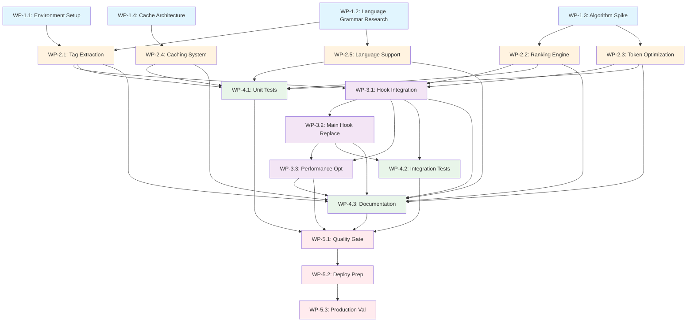

# Dependency Matrix: Tree-Sitter Repository Map Implementation

## Overview

This document provides a comprehensive view of all dependencies within the Tree-Sitter Repository Map implementation phase, including work package dependencies, technical dependencies, and resource dependencies.

## Work Package Dependency Graph



## Critical Path Analysis

### Primary Critical Path
```
WP-1.2 (4h) → WP-2.1 (8h) → WP-3.1 (6h) → WP-3.2 (4h) → WP-3.3 (6h) → WP-5.1 (4h) → WP-5.2 (4h) → WP-5.3 (4h)
Total: 40 hours (sequential)
```

### Secondary Critical Paths
```
Path 2: WP-1.3 (6h) → WP-2.2 (8h) → WP-3.1 (6h) → ...
Path 3: WP-1.4 (4h) → WP-2.4 (8h) → WP-4.1 (8h) → WP-5.1 (4h) → ...
```

## Dependency Types

### 1. Hard Dependencies (Blocking)
| Dependent WP | Requires | Type | Reason |
|-------------|----------|------|--------|
| WP-2.1 | WP-1.1, WP-1.2 | Technical | Need environment and grammars |
| WP-2.2 | WP-1.3 | Technical | Algorithm design required |
| WP-2.3 | WP-1.3 | Technical | Optimization patterns needed |
| WP-2.4 | WP-1.4 | Technical | Cache architecture required |
| WP-2.5 | WP-1.2 | Technical | Grammar research needed |
| WP-3.1 | WP-2.1, WP-2.2, WP-2.3 | Integration | Core modules required |
| WP-3.2 | WP-3.1 | Sequential | Integration layer needed |
| WP-3.3 | WP-3.1, WP-3.2 | Sequential | Full system for optimization |
| WP-5.1 | All WP-4.x, WP-3.3 | Quality | Complete system for review |
| WP-5.2 | WP-5.1 | Process | Approval required |
| WP-5.3 | WP-5.2 | Process | Deployment package needed |

### 2. Soft Dependencies (Beneficial)
| Dependent WP | Benefits From | Type | Benefit |
|-------------|---------------|------|---------|
| WP-4.1 | WP-2.x modules | Testing | Earlier test development |
| WP-4.2 | WP-3.1 | Testing | Integration test prep |
| WP-4.3 | All development | Documentation | Complete context |
| WP-3.3 | WP-4.1 | Performance | Test feedback for optimization |

### 3. Resource Dependencies
| Work Package | Required Resources | Conflict Potential |
|-------------|-------------------|-------------------|
| WP-1.1 | Python environment | Low |
| WP-1.2 | Language expertise | Low |
| WP-1.3 | Algorithm knowledge | Low |
| WP-1.4 | Architecture skills | Low |
| WP-2.1 | Parser expertise | Medium (with WP-2.5) |
| WP-2.2 | Graph algorithms | Low |
| WP-2.3 | Optimization skills | Low |
| WP-2.4 | Database knowledge | Low |
| WP-2.5 | Language expertise | Medium (with WP-2.1) |
| WP-3.1 | Integration skills | High (sequential) |
| WP-3.2 | Hook knowledge | High (sequential) |
| WP-3.3 | Performance tools | High (sequential) |

## Technical Dependencies

### External Library Dependencies
```yaml
Core Dependencies:
  tree-sitter: ">=0.20.0"
  tree-sitter-languages: ">=1.10.0"
  networkx: ">=3.0"
  diskcache: ">=5.6.0"
  
Language Support:
  tree-sitter-python: ">=0.20.0"
  tree-sitter-javascript: ">=0.20.0"
  tree-sitter-typescript: ">=0.20.0"
  tree-sitter-go: ">=0.20.0"
  tree-sitter-rust: ">=0.20.0"
  tree-sitter-java: ">=0.20.0"
  
Utilities:
  pathspec: ">=0.12.0"
  pygments: ">=2.17.0"
```

### System Dependencies
```yaml
Infrastructure:
  - Python: ">=3.8"
  - SQLite: ">=3.35"
  - Git: "For repository access"
  - File System: "Read access to codebase"
  
Performance:
  - Memory: ">=1GB available"
  - CPU: "Multi-core for parallel parsing"
  - Storage: ">=100MB for cache"
```

### Internal System Dependencies
```yaml
Hook System:
  - UserPromptSubmit: "Hook point"
  - Session Management: "Context extraction"
  - Error Reporting: "Failure handling"
  
Communication:
  - WebSocket: "Real-time updates"
  - Event System: "Status reporting"
  - Logging: "Debug and monitoring"
```

## Parallelization Opportunities

### Maximum Parallel Execution
```
Batch 1: 4 agents parallel (18 hours total, 6 hours wall time)
Batch 2: 5 agents parallel (36 hours total, 8 hours wall time)
Batch 3: Sequential only (16 hours total, 16 hours wall time)
Batch 4: 3 agents parallel (20 hours total, 8 hours wall time)
Batch 5: Sequential only (12 hours total, 12 hours wall time)

Total: 102 hours effort, ~50 hours wall time with parallelization
Efficiency: 51% time reduction through parallelization
```

### Parallelization Constraints
1. **Batch 1**: Fully parallelizable, no constraints
2. **Batch 2**: Parallel with careful file separation
3. **Batch 3**: Must be sequential due to integration
4. **Batch 4**: Can start once dependencies met
5. **Batch 5**: Strictly sequential for quality control

## Risk Dependencies

### High-Risk Dependencies
| Dependency | Risk | Impact | Mitigation |
|------------|------|--------|------------|
| tree-sitter libraries | Version conflicts | High | Lock versions, test early |
| WP-2.1 → WP-3.1 | Parser failures | High | Fallback mechanisms |
| WP-3.2 completion | Deployment blocker | High | Early integration testing |
| External API changes | Breaking changes | Medium | Version pinning |

### Circular Dependencies
**None identified** - The dependency graph is acyclic (DAG)

## Optimization Strategies

### 1. Fast-Track Options
- Start WP-4.1 unit tests during Batch 2 development
- Begin WP-4.3 documentation as modules complete
- Overlap WP-3.3 performance optimization with WP-4.2 testing

### 2. Batch Compression
- Combine WP-1.1 and WP-1.2 if same engineer has both skills
- Merge WP-3.2 and WP-3.3 for experienced integrator
- Consolidate WP-5.2 and WP-5.3 for faster deployment

### 3. Dependency Reduction
- Create module interfaces early to reduce coupling
- Use mocks for testing to start WP-4.1 earlier
- Implement feature flags for incremental rollout

## Dependency Validation Checklist

### Pre-Batch Validation
- [ ] Batch 1: Development environment ready
- [ ] Batch 2: All Batch 1 outputs available
- [ ] Batch 3: Core modules tested and stable
- [ ] Batch 4: Integration layer functional
- [ ] Batch 5: All tests passing

### Inter-Batch Handoffs
- [ ] WP-1.2 → WP-2.1: Grammar files complete
- [ ] WP-1.3 → WP-2.2/2.3: Algorithms validated
- [ ] WP-2.x → WP-3.1: Modules integrated
- [ ] WP-3.x → WP-4.2: System testable
- [ ] WP-4.x → WP-5.1: Quality metrics met

## Monitoring and Tracking

### Dependency Status Indicators
```
🟢 Green: Dependency satisfied, work can proceed
🟡 Yellow: Dependency partially met, limited progress possible
🔴 Red: Dependency blocked, work cannot start
⚪ Gray: Future dependency, not yet relevant
```

### Current Status (Planning Phase)
```
All dependencies: ⚪ Gray (Not started)
```

### Daily Dependency Review Points
1. Morning: Check overnight completions
2. Midday: Validate parallel work progress
3. Evening: Confirm handoffs for next day

## Contingency Plans

### If Critical Path Delayed
1. **WP-1.2 delayed**: Start with Python only, add languages later
2. **WP-2.1 delayed**: Focus on WP-2.2/2.3 optimization
3. **WP-3.1 delayed**: Extend testing phase preparation
4. **WP-5.1 delayed**: Prepare soft launch with feature flags

### If Dependencies Fail
1. **tree-sitter unavailable**: Implement regex-based fallback
2. **NetworkX issues**: Use simple ranking algorithm
3. **Cache system fails**: Deploy without caching initially
4. **Integration blocked**: Use standalone CLI version

---

**Document Status:** Complete
**Dependency Count:** 31 direct dependencies
**Critical Path Length:** 40 hours
**Parallelization Efficiency:** 51%
**Risk Level:** Medium (multiple mitigation strategies available)