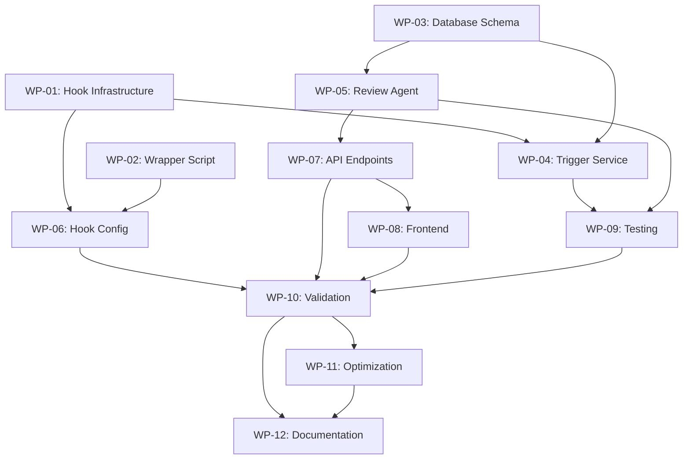

# Work Package Breakdown - Phase 06: Session Review Agent

**Phase ID:** 06-SessionReviewAgent  
**Created:** 2025-08-20  
**Planner:** TomVortex  

## Work Package Summary

Total Work Packages: 12  
Parallel Execution Batches: 5  
Critical Path Length: 5 days  

## Batch 1: Foundation Setup (Day 1 Morning)
*All WPs in this batch can execute in parallel*

### WP-01: Hook Script Infrastructure
**Owner:** Backend Engineer 1  
**Duration:** 4 hours  
**Dependencies:** None  

**Scope:**
- Create `.claude/hooks/session-inject/` directory structure
- Implement `inject_session_id.py` for Task tool interception
- Add session ID injection logic into prompts
- Handle edge cases and error scenarios

**Deliverables:**
- Working session injection hook script
- Unit tests for injection logic
- Error handling documentation

**Success Criteria:**
- Task prompts receive session ID context
- No errors on missing session IDs
- Maintains original prompt integrity

---

### WP-02: Wrapper Script Implementation
**Owner:** DevOps Engineer  
**Duration:** 4 hours  
**Dependencies:** None  

**Scope:**
- Create `.claude/hooks/wrappers/getCurrentSessionId.sh`
- Implement session logging mechanism
- Setup PATH manipulation instructions
- Create installation script

**Deliverables:**
- getCurrentSessionId.sh wrapper script
- PATH configuration documentation
- Installation automation script

**Success Criteria:**
- Wrapper intercepts session ID calls
- Logs session access to file
- Original functionality preserved

---

### WP-03: Database Schema Extensions
**Owner:** Backend Engineer 2  
**Duration:** 3 hours  
**Dependencies:** None  

**Scope:**
- Design review tables schema
- Create migration scripts
- Add necessary indexes
- Test database performance

**Deliverables:**
- Migration SQL scripts
- Database schema documentation
- Performance test results

**Success Criteria:**
- Tables created successfully
- Indexes optimize query performance
- No impact on existing tables

## Batch 2: Core Implementation (Day 1 Afternoon - Day 2 Morning)
*WPs can execute in parallel after Batch 1 completes*

### WP-04: Review Trigger Service
**Owner:** Backend Engineer 1  
**Duration:** 6 hours  
**Dependencies:** WP-01, WP-03  

**Scope:**
- Implement `check_review_trigger.py`
- Create configuration management
- Add session metrics fetching
- Implement trigger evaluation logic

**Deliverables:**
- Review trigger service script
- Configuration file template
- Trigger logic documentation

**Success Criteria:**
- Correctly evaluates trigger conditions
- Configurable thresholds work
- Async execution without blocking

---

### WP-05: Session Review Agent Core
**Owner:** Backend Engineer 2  
**Duration:** 8 hours  
**Dependencies:** WP-03  

**Scope:**
- Implement `session_review_agent.py`
- Create pattern analysis algorithms
- Implement scoring system
- Generate recommendations logic

**Deliverables:**
- Review agent script
- Analysis algorithm documentation
- Scoring rubric definition

**Success Criteria:**
- Analyzes session data accurately
- Generates meaningful scores
- Produces actionable recommendations

---

### WP-06: Hook Configuration Updates
**Owner:** DevOps Engineer  
**Duration:** 2 hours  
**Dependencies:** WP-01, WP-02  

**Scope:**
- Update `.claude/settings.json`
- Add new hook configurations
- Test hook chain execution
- Document configuration changes

**Deliverables:**
- Updated settings.json
- Configuration backup
- Hook chain test results

**Success Criteria:**
- Hooks trigger correctly
- No conflicts with existing hooks
- Proper execution order

## Batch 3: API & Integration (Day 2 Afternoon - Day 3 Morning)
*Parallel execution after Batch 2*

### WP-07: Review API Endpoints
**Owner:** Backend Engineer 1  
**Duration:** 5 hours  
**Dependencies:** WP-05  

**Scope:**
- Implement review queue endpoint
- Create results retrieval endpoint
- Add review submission endpoint
- Implement async processing

**Deliverables:**
- API endpoint implementations
- API documentation
- Postman collection

**Success Criteria:**
- Endpoints respond correctly
- Async processing works
- Error handling robust

---

### WP-08: Frontend Components
**Owner:** Frontend Engineer  
**Duration:** 8 hours  
**Dependencies:** WP-07 (loose - can start UI before API)  

**Scope:**
- Create SessionReviewPanel.vue
- Implement score visualization
- Add recommendations display
- Create review timeline view

**Deliverables:**
- Vue component files
- Component styling
- Component documentation

**Success Criteria:**
- Reviews display correctly
- Responsive design works
- Smooth animations

---

### WP-09: Integration Testing Suite
**Owner:** QA Engineer  
**Duration:** 6 hours  
**Dependencies:** WP-04, WP-05  

**Scope:**
- Create unit test suite
- Implement integration tests
- Setup E2E test scenarios
- Create test data fixtures

**Deliverables:**
- Test suite implementation
- Test data fixtures
- Test execution reports

**Success Criteria:**
- >90% code coverage
- All integration tests pass
- E2E scenarios validated

## Batch 4: Validation & Optimization (Day 3 Afternoon - Day 4)
*Sequential after Batch 3*

### WP-10: Manual Validation
**Owner:** Full Team  
**Duration:** 4 hours  
**Dependencies:** WP-07, WP-08  

**Scope:**
- Test with session ID: 8d90abf7-bd33-4367-985c-b5acb886a63a
- Validate injection mechanism
- Test review triggering
- Verify UI display

**Deliverables:**
- Validation test results
- Bug reports
- Performance metrics

**Success Criteria:**
- Test session works correctly
- All features functional
- Performance targets met

---

### WP-11: Performance Optimization
**Owner:** Backend Engineer 2  
**Duration:** 4 hours  
**Dependencies:** WP-10  

**Scope:**
- Profile hook execution
- Optimize database queries
- Implement caching where needed
- Reduce latency bottlenecks

**Deliverables:**
- Performance profile reports
- Optimization implementations
- Updated performance metrics

**Success Criteria:**
- Hook latency <100ms
- Query time <200ms
- Memory usage optimized

## Batch 5: Documentation & Deployment (Day 4-5)
*Final batch after all implementation complete*

### WP-12: Documentation & Training
**Owner:** Full Team  
**Duration:** 6 hours  
**Dependencies:** All previous WPs  

**Scope:**
- Update implementation guide
- Create troubleshooting guide
- Record demo video
- Prepare team briefing

**Deliverables:**
- Complete documentation
- Demo materials
- Training slides

**Success Criteria:**
- Documentation complete
- Team trained
- Knowledge transferred

## Dependency Matrix

## Critical Path

WP-03 → WP-05 → WP-07 → WP-10 → WP-11 → WP-12

Critical path duration: 31 hours (~4 days with parallel execution)

## Resource Allocation

### Day 1
- Morning: WP-01, WP-02, WP-03 (parallel)
- Afternoon: WP-04, WP-05 start

### Day 2
- Morning: WP-05 complete, WP-06
- Afternoon: WP-07, WP-08 start

### Day 3
- Morning: WP-08 complete, WP-09
- Afternoon: WP-10

### Day 4
- Morning: WP-11
- Afternoon: WP-12 start

### Day 5
- Morning: WP-12 complete
- Afternoon: Deployment and verification

## Risk Mitigation

1. **Hook Failures**: WP-01 includes comprehensive error handling
2. **Performance Issues**: WP-11 dedicated to optimization
3. **Integration Problems**: WP-09 provides early detection
4. **PATH Conflicts**: WP-02 includes clear documentation

## Parallel Execution Opportunities

- **Batch 1**: 3 WPs fully parallel (11 hours → 4 hours)
- **Batch 2**: 3 WPs partially parallel (16 hours → 8 hours)
- **Batch 3**: 2 WPs parallel (13 hours → 8 hours)
- **Total Time Saved**: ~12 hours through parallelization

## Success Metrics Tracking

| Metric | Target | WP Responsible |
|--------|--------|----------------|
| Hook Latency | <100ms | WP-11 |
| Code Coverage | >90% | WP-09 |
| API Response Time | <200ms | WP-07 |
| UI Load Time | <2s | WP-08 |
| Documentation Completeness | 100% | WP-12 |