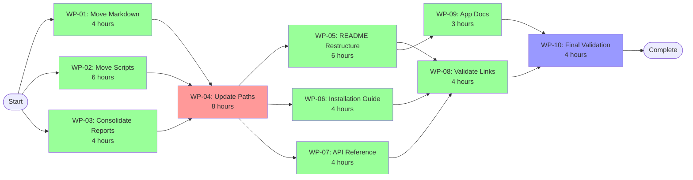

# Dependency Matrix - Phase 06: Codebase Maintenance

## Critical Path Analysis

**Critical Path Length:** 7 days  
**Critical Path:** WP-01/02/03 → WP-04 → WP-05/06/07 → WP-08/09 → WP-10

## Dependency Visualization

## Dependency Types

### Hard Dependencies (Blocking)

| Work Package | Depends On | Dependency Type | Reason |
|-------------|------------|-----------------|---------|
| WP-04 | WP-01, WP-02, WP-03 | File Movement | Cannot update paths until files are moved |
| WP-05 | WP-04 | Path Updates | README must reference correct paths |
| WP-06 | WP-04 | Path Updates | Guide must reference correct locations |
| WP-07 | WP-04 | Path Updates | API docs need correct script paths |
| WP-08 | WP-05, WP-06, WP-07 | Content Creation | Cannot validate links until docs exist |
| WP-09 | WP-05 | README Structure | App docs must align with main README |
| WP-10 | WP-08, WP-09 | All Changes | Final validation needs everything complete |

### Soft Dependencies (Recommended Sequence)

| Work Package | Recommended After | Type | Reason |
|-------------|------------------|------|---------|
| WP-06 | WP-05 starts | Coordination | Align guide structure with README |
| WP-07 | WP-05 starts | Coordination | Consistent documentation style |
| WP-09 | WP-08 starts | Quality | Benefit from link validation patterns |

## Parallel Execution Opportunities

### Batch 1: Maximum Parallelization (Day 1-2)
**Parallel WPs:** WP-01, WP-02, WP-03  
**Resources:** 3 engineers  
**Duration:** 6 hours (limited by WP-02)  
**Optimization:** No dependencies between tasks

### Batch 2: Critical Sequential (Day 3)
**Sequential WP:** WP-04  
**Resources:** 1 engineer  
**Duration:** 8 hours  
**Note:** Cannot parallelize - all downstream work depends on this

### Batch 3: Documentation Parallel (Day 4-5)
**Parallel WPs:** WP-05, WP-06, WP-07  
**Resources:** 3 engineers  
**Duration:** 6 hours (limited by WP-05)  
**Optimization:** Independent documentation tasks

### Batch 4: Validation Parallel (Day 6)
**Parallel WPs:** WP-08, WP-09  
**Resources:** 2 engineers  
**Duration:** 4 hours (limited by WP-08)  
**Optimization:** Different validation scopes

### Batch 5: Final Sequential (Day 7)
**Sequential WP:** WP-10  
**Resources:** 1 engineer  
**Duration:** 4 hours  
**Note:** Requires all previous work complete

## Resource Optimization Matrix

| Time Period | WP Active | Engineers | Utilization | Notes |
|------------|-----------|-----------|-------------|-------|
| Day 1-2 | WP-01, WP-02, WP-03 | 3 | 100% | Full parallel |
| Day 3 | WP-04 | 1 | 33% | Critical path bottleneck |
| Day 4-5 | WP-05, WP-06, WP-07 | 3 | 100% | Full parallel |
| Day 6 | WP-08, WP-09 | 2 | 67% | Partial parallel |
| Day 7 | WP-10 | 1 | 33% | Final validation |

**Average Utilization:** 67%

## Risk Impact Analysis

### High Impact Dependencies

1. **WP-04 Delay Impact**
   - Blocks all documentation work (WP-05, 06, 07)
   - Cascades to validation (WP-08, 09)
   - Could delay project by full duration of delay

2. **WP-05 Delay Impact**
   - Blocks WP-08 link validation
   - Blocks WP-09 app documentation
   - Could delay completion by up to 2 days

### Mitigation Strategies

1. **WP-04 Risk Mitigation**
   - Assign most experienced engineer
   - Create automated path update script
   - Have backup engineer available
   - Start planning during Batch 1

2. **Parallel Batch Mitigation**
   - Cross-train engineers on tasks
   - Daily sync to identify blockers
   - Shared documentation templates
   - Clear handoff protocols

## Optimization Opportunities

### Current Schedule: 7 days

### Optimized Schedule: 5 days (with 5 engineers)

**Optimization Changes:**
1. Add 2 engineers to Batch 2 (WP-04)
   - Split path updates by module
   - Reduce from 8 to 4 hours
   
2. Combine Batch 4 and 5
   - Run WP-10 validation in parallel with WP-08/09
   - Use 3 engineers for comprehensive validation

**New Critical Path:** 5 days (30% reduction)

## Dependency Compliance Checklist

### Pre-Batch Verification

- [ ] Batch 1: All engineers have git mv permissions
- [ ] Batch 2: File movements complete and verified
- [ ] Batch 3: All paths updated and tested
- [ ] Batch 4: Documentation content created
- [ ] Batch 5: All previous work verified

### Inter-Batch Handoff Protocol

1. **Batch Completion Criteria**
   - All WPs in batch marked complete
   - Deliverables verified by owner
   - No blocking issues identified
   - Next batch engineers notified

2. **Handoff Documentation**
   - List of changes made
   - Any issues encountered
   - Updated file locations
   - Test results

## Success Metrics by Dependency Chain

### Chain 1: File Organization (WP-01/02/03 → WP-04)
- Metric: All files moved with history preserved
- Validation: Git log shows continuous history
- Success Rate Target: 100%

### Chain 2: Documentation Creation (WP-04 → WP-05/06/07)
- Metric: All documentation created with correct references
- Validation: No broken internal links
- Success Rate Target: 95%

### Chain 3: Final Validation (WP-08/09 → WP-10)
- Metric: All systems operational
- Validation: Full test suite passes
- Success Rate Target: 100%

## Contingency Plans

### If Batch 1 Delayed
- Impact: Entire project delayed
- Action: Add resources immediately
- Maximum Delay: 1 day before escalation

### If WP-04 Blocked
- Impact: 4-day cascade delay
- Action: Architect consultation
- Fallback: Partial implementation with staged updates

### If Documentation Quality Issues
- Impact: Rework required
- Action: Real-time review during creation
- Prevention: Templates and examples provided

## Communication Matrix

| Dependency | Communication Required | Method | Timing |
|-----------|----------------------|---------|---------|
| WP-01→04 | File move completion | Team channel | Immediate |
| WP-02→04 | Script move completion | Team channel | Immediate |
| WP-03→04 | Report consolidation done | Team channel | Immediate |
| WP-04→05/06/07 | Paths updated | Team broadcast | Before start |
| WP-05/06/07→08 | Docs ready for validation | Team channel | On completion |
| WP-08/09→10 | Validation ready | Team channel | On completion |

## Dependency Verification Gates

### Gate 1: Post File Movement (after Batch 1)
- Verify all files moved
- Confirm git history preserved
- Check no files missed
- Run basic smoke tests

### Gate 2: Post Path Updates (after Batch 2)
- All imports working
- Scripts executable
- Tests passing
- No console errors

### Gate 3: Post Documentation (after Batch 3)
- Documentation complete
- Formatting correct
- Content accurate
- Structure logical

### Gate 4: Final Verification (after Batch 5)
- All objectives met
- Success criteria achieved
- No regressions
- Team sign-off

This dependency matrix ensures optimal parallelization while maintaining critical path integrity and providing clear risk mitigation strategies.