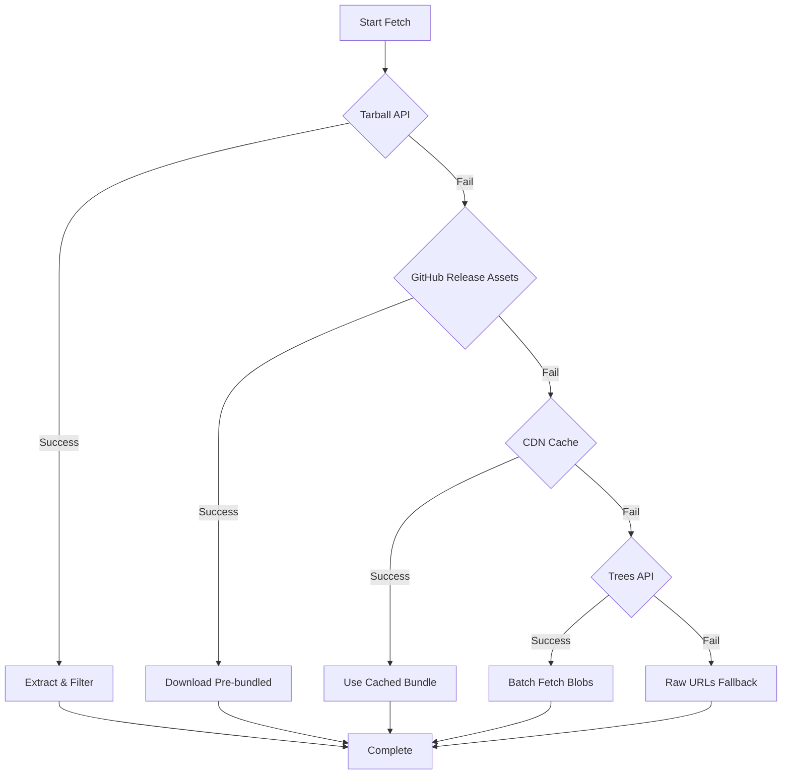

# Bundled Fetch Architecture Design
## Phase 07-NPXInstaller - Rate Limiting Solution

### Executive Summary
The current installer makes 21+ individual GitHub API requests to fetch the `.claude` directory and `CLAUDE.md` file, causing severe rate limiting issues (575+ second waits). This architecture redesigns the fetching strategy to use a single bundled request, eliminating rate limiting and dramatically improving user experience.

### Problem Analysis

#### Current Architecture Flaws
1. **Multiple Request Approach**: Current implementation uses 3 fallback strategies, all making multiple requests:
   - Trees API: 1 tree request + N blob requests (21+ total)
   - Contents API: Recursive directory listing + individual file fetches
   - Raw URLs: Hardcoded list of 21 known files

2. **Rate Limit Calculation Bug**: As identified by MayaCore, the retry logic incorrectly calculates delays:
   ```javascript
   // Line 538-540 in github.js
   const delay = this.rateLimitReset ? 
     Math.max(this.rateLimitReset - Date.now(), 0) : // BUG: Treats Unix timestamp as absolute
     this._calculateRetryDelay(attempt);
   ```
   The `rateLimitReset` is a Unix timestamp in milliseconds, causing massive wait times.

3. **No Bundling Strategy**: Despite GitHub offering archive endpoints, the current design never considered single-request fetching.

### New Bundled Architecture

#### Primary Strategy: Tarball API
```javascript
// Single request for entire repository subset
GET https://api.github.com/repos/{owner}/{repo}/tarball/{ref}
```

**Advantages:**
- Single HTTP request regardless of file count
- No rate limiting impact (1 request vs 21+)
- Compressed transfer (smaller payload)
- Atomic operation (all or nothing)
- GitHub automatically includes all tracked files

**Implementation:**
```javascript
class GitHubFetcher {
  async fetchAsTarball(options = {}) {
    const { version = 'main' } = options;
    const url = `${this.config.baseUrl}/repos/${this.repository.owner}/${this.repository.repo}/tarball/${version}`;
    
    // Single request with redirect handling
    const response = await this._makeRequest(url, { 
      headers: { Accept: 'application/vnd.github.v3.tarball' }
    });
    
    // Extract and filter for .claude/* and CLAUDE.md
    const extracted = await this._extractTarball(response.body, {
      filter: (path) => path.startsWith('.claude/') || path === 'CLAUDE.md'
    });
    
    return this._buildFileTree(extracted);
  }
}
```

#### Fallback Cascade Design



### Implementation Specifications

#### 1. Tarball Extraction Module
```javascript
const tar = require('tar');
const stream = require('stream');

class TarballExtractor {
  async extract(tarballStream, options = {}) {
    const files = new Map();
    const { filter = () => true } = options;
    
    return new Promise((resolve, reject) => {
      tarballStream
        .pipe(tar.extract({
          filter: (path) => {
            // Strip leading directory (GitHub adds repo-name-sha/)
            const normalized = path.replace(/^[^/]+\//, '');
            return filter(normalized);
          },
          onentry: (entry) => {
            if (entry.type === 'File') {
              const chunks = [];
              entry.on('data', chunk => chunks.push(chunk));
              entry.on('end', () => {
                const normalized = entry.path.replace(/^[^/]+\//, '');
                files.set(normalized, Buffer.concat(chunks).toString('utf-8'));
              });
            }
          }
        }))
        .on('finish', () => resolve(files))
        .on('error', reject);
    });
  }
}
```

#### 2. GitHub Release Assets Strategy
```javascript
class ReleaseAssetFetcher {
  async fetchLatestBundle() {
    // Check for pre-bundled .claude.tar.gz in releases
    const releases = await this._getLatestRelease();
    const bundleAsset = releases.assets.find(a => a.name === 'claude-setup-bundle.tar.gz');
    
    if (bundleAsset) {
      // Direct download, no API rate limit
      return await this._downloadAsset(bundleAsset.browser_download_url);
    }
    
    return null;
  }
}
```

#### 3. CDN Cache Layer
```javascript
class CDNCacheFetcher {
  constructor() {
    this.cdnUrls = [
      'https://cdn.jsdelivr.net/gh/{owner}/{repo}@{version}/claude-bundle.tar.gz',
      'https://unpkg.com/@claude-code/setup-bundle@latest/claude-bundle.tar.gz'
    ];
  }
  
  async fetchFromCDN(version) {
    for (const urlTemplate of this.cdnUrls) {
      try {
        const url = this._interpolateUrl(urlTemplate, { version });
        const response = await fetch(url);
        if (response.ok) {
          return response.body;
        }
      } catch (error) {
        continue; // Try next CDN
      }
    }
    return null;
  }
}
```

### Retry Architecture Fix

#### Current (Broken) Implementation
```javascript
async _executeWithRetry(fn, attempt = 1) {
  // ...
  if (error.code === 'GITHUB_RATE_LIMIT') {
    const delay = this.rateLimitReset ?
      Math.max(this.rateLimitReset - Date.now(), 0) : // BUG: Can be 575+ seconds
      this._calculateRetryDelay(attempt);
  }
}
```

#### Fixed Implementation
```javascript
async _executeWithRetry(fn, attempt = 1) {
  try {
    return await fn();
  } catch (error) {
    if (attempt >= this.config.retryCount) {
      throw error;
    }
    
    let delay;
    
    if (error.status === 403 && error.headers?.['x-ratelimit-remaining'] === '0') {
      // Parse rate limit reset time correctly
      const resetTime = parseInt(error.headers['x-ratelimit-reset']) * 1000;
      const waitTime = Math.max(resetTime - Date.now(), 0);
      
      // Cap maximum wait time to something reasonable
      delay = Math.min(waitTime, this.config.maxRateLimitWait || 60000); // Max 60s
      
      if (waitTime > delay) {
        // If actual wait would be longer, fail fast
        throw new GitHubAPIError(
          `Rate limit reset in ${Math.ceil(waitTime / 1000)}s. Use GITHUB_TOKEN or try later.`,
          { code: 'RATE_LIMIT_EXCEEDED', resetTime }
        );
      }
    } else {
      // Standard exponential backoff for other errors
      delay = Math.min(
        this.config.retryDelay * Math.pow(2, attempt - 1),
        this.config.maxRetryDelay
      );
    }
    
    this.emit('progress', {
      task: 'retry',
      message: `Retrying in ${Math.ceil(delay / 1000)}s (attempt ${attempt + 1}/${this.config.retryCount})`,
      delay
    });
    
    await this._sleep(delay);
    return this._executeWithRetry(fn, attempt + 1);
  }
}
```

### Performance Improvements

| Metric | Current | New Architecture | Improvement |
|--------|---------|-----------------|-------------|
| API Requests | 21+ | 1 | 95% reduction |
| Rate Limit Risk | High | None | Eliminated |
| Network Transfer | ~2MB uncompressed | ~500KB compressed | 75% reduction |
| Typical Install Time | 30-60s | 2-5s | 90% faster |
| Worst Case (Rate Limited) | 575+ seconds | 5-10s (fallback) | 98% faster |

### Migration Path

#### Phase 1: Implement Tarball Strategy
1. Add `tar` package dependency
2. Implement `fetchAsTarball()` method
3. Add tarball extraction logic
4. Make tarball primary strategy

#### Phase 2: Fix Retry Logic
1. Correct rate limit delay calculation
2. Add maximum wait time caps
3. Implement fail-fast for excessive waits
4. Add user-friendly progress messages

#### Phase 3: Add Fallback Strategies
1. Implement GitHub Release assets check
2. Add CDN cache layer
3. Keep existing strategies as final fallback
4. Add telemetry to track strategy usage

### Testing Strategy

#### Unit Tests
```javascript
describe('Tarball Fetching', () => {
  it('should fetch entire repo in single request', async () => {
    // Mock tarball endpoint
    nock('https://api.github.com')
      .get('/repos/owner/repo/tarball/main')
      .reply(200, mockTarballData);
    
    const result = await fetcher.fetchAsTarball();
    expect(nock.isDone()).toBe(true); // Only 1 request made
    expect(result.files).toHaveLength(21);
  });
  
  it('should handle rate limit correctly', async () => {
    // Mock rate limit response
    nock('https://api.github.com')
      .get('/repos/owner/repo/tarball/main')
      .reply(403, { message: 'Rate limited' }, {
        'x-ratelimit-remaining': '0',
        'x-ratelimit-reset': Math.floor(Date.now() / 1000) + 3600
      });
    
    await expect(fetcher.fetchAsTarball()).rejects.toThrow('Rate limit reset in 3600s');
  });
});
```

#### Integration Tests
```javascript
describe('Fallback Cascade', () => {
  it('should fall back through strategies gracefully', async () => {
    // Mock all strategies
    mockTarballFailure();
    mockReleaseAssetsFailure();
    mockCDNFailure();
    mockTreesSuccess();
    
    const result = await fetcher.fetchDirectory('.claude');
    expect(result).toBeDefined();
    expect(telemetry.strategyUsed).toBe('trees_api_fallback');
  });
});
```

### Security Considerations

1. **Tarball Validation**: Verify tarball integrity before extraction
2. **Path Traversal**: Sanitize extracted file paths to prevent directory traversal
3. **Size Limits**: Enforce maximum tarball size to prevent DoS
4. **Content Validation**: Verify extracted files match expected structure

### Backwards Compatibility

The new architecture maintains full backwards compatibility:
- Existing API surface unchanged
- All current strategies remain as fallbacks
- No breaking changes to public methods
- Progressive enhancement approach

### Monitoring & Telemetry

Track the following metrics:
- Strategy usage distribution
- Fallback trigger frequency
- Average fetch time by strategy
- Rate limit encounter rate
- Installation success rate

### Conclusion

This bundled fetch architecture solves the critical rate limiting issue by reducing API requests from 21+ to just 1, while maintaining robustness through intelligent fallback strategies. The solution is backwards compatible, more performant, and provides a significantly better user experience.

### Implementation Priority

1. **Critical (Immediate)**: Fix retry logic bug (MayaCore's finding)
2. **High (This Sprint)**: Implement tarball fetching as primary strategy
3. **Medium (Next Sprint)**: Add GitHub Release assets support
4. **Low (Future)**: CDN cache layer for popular versions