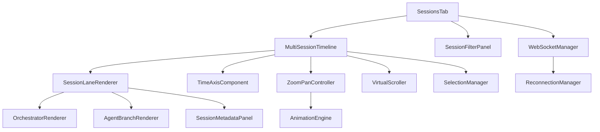

# Sessions Tab Requirements Traceability Matrix

## Overview
This matrix maps requirements to implementation components, test cases, and verification methods to ensure complete coverage of the Sessions tab functionality.

## Traceability Legend
- **REQ**: Requirement ID from sessions-tab-requirements.md
- **COMP**: Component responsible for implementation
- **TEST**: Test case reference
- **VER**: Verification method (UT=Unit Test, IT=Integration Test, UAT=User Acceptance Test, PT=Performance Test)
- **STATUS**: Implementation status (🔴 Not Started, 🟡 In Progress, 🟢 Complete, ✅ Verified)

## Requirements to Components Mapping

| REQ ID | Requirement | Component | Test ID | VER | Priority | Status |
|--------|-------------|-----------|---------|-----|----------|--------|
| **Core Functionality** |
| US-01 | View Multiple Sessions | MultiSessionTimeline | TC-01 | IT | P0 | 🔴 |
| US-01.1 | Display 20 sessions | SessionLaneRenderer | TC-01.1 | PT | P0 | 🔴 |
| US-01.2 | Session identifiers | SessionLabel | TC-01.2 | UT | P0 | 🔴 |
| US-01.3 | Vertical stacking | SessionLayoutManager | TC-01.3 | UT | P0 | 🔴 |
| US-01.4 | Consistent time axis | TimeAxisComponent | TC-01.4 | UT | P0 | 🔴 |
| US-01.5 | Start/end visibility | SessionTimeBounds | TC-01.5 | IT | P0 | 🔴 |
| US-01.6 | Relative positioning | TimelineCoordinator | TC-01.6 | IT | P0 | 🔴 |
| **Time Window Management** |
| US-02 | Default 1-hour view | SessionsTab | TC-02 | UAT | P0 | 🔴 |
| US-02.1 | Auto-include active | TimeWindowManager | TC-02.1 | UT | P0 | 🔴 |
| US-02.2 | Historical visibility | DataWindowLoader | TC-02.2 | IT | P0 | 🔴 |
| US-02.3 | Real-time axis | TimeAxisUpdater | TC-02.3 | UT | P0 | 🔴 |
| US-02.4 | Now marker | NowIndicator | TC-02.4 | UT | P0 | 🔴 |
| US-02.5 | Empty state | EmptyStateHandler | TC-02.5 | UT | P0 | 🔴 |
| **Navigation Controls** |
| US-03 | Zoom and Pan | ZoomPanController | TC-03 | UAT | P0 | 🔴 |
| US-03.1 | Zoom range | ZoomLevelManager | TC-03.1 | UT | P0 | 🔴 |
| US-03.2 | 60fps animation | AnimationEngine | TC-03.2 | PT | P0 | 🔴 |
| US-03.3 | Mouse drag pan | PanGestureHandler | TC-03.3 | IT | P0 | 🔴 |
| US-03.4 | Keyboard shortcuts | KeyboardController | TC-03.4 | IT | P0 | 🔴 |
| US-03.5 | Cursor zoom | ZoomFocusManager | TC-03.5 | UT | P0 | 🔴 |
| US-03.6 | Zoom indicator | ZoomLevelDisplay | TC-03.6 | UT | P0 | 🔴 |
| US-03.7 | Reset view | ViewResetButton | TC-03.7 | IT | P0 | 🔴 |
| **Session Visualization** |
| US-04 | Session Lanes | SessionLane | TC-04 | IT | P0 | 🔴 |
| US-04.1 | Fixed lane height | LaneHeightManager | TC-04.1 | UT | P0 | 🔴 |
| US-04.2 | Orchestrator line | OrchestratorRenderer | TC-04.2 | UT | P0 | 🔴 |
| US-04.3 | Agent branches | AgentBranchRenderer | TC-04.3 | IT | P0 | 🔴 |
| US-04.4 | Auto-sizing | LaneAutoSizer | TC-04.4 | UT | P0 | 🔴 |
| US-04.5 | Lane separators | LaneSeparator | TC-04.5 | UT | P0 | 🔴 |
| US-04.6 | Session metadata | SessionMetadataPanel | TC-04.6 | UT | P0 | 🔴 |
| **Agent Details** |
| US-05 | Agent Visibility | AgentRenderer | TC-05 | IT | P1 | 🔴 |
| US-05.1 | Color coding | AgentColorMapper | TC-05.1 | UT | P1 | 🔴 |
| US-05.2 | Agent names | AgentLabelRenderer | TC-05.2 | UT | P1 | 🔴 |
| US-05.3 | Active animation | AgentAnimator | TC-05.3 | UT | P1 | 🔴 |
| US-05.4 | Completion points | CompletionMarker | TC-05.4 | UT | P1 | 🔴 |
| US-05.5 | Error indicators | ErrorHighlighter | TC-05.5 | UT | P1 | 🔴 |
| US-05.6 | Batch spawn points | BatchSpawnMarker | TC-05.6 | UT | P1 | 🔴 |
| **Filtering** |
| US-06 | Session Filtering | SessionFilterPanel | TC-06 | UAT | P1 | 🔴 |
| US-06.1 | ID filter | IdFilterInput | TC-06.1 | UT | P1 | 🔴 |
| US-06.2 | Time range filter | TimeRangePicker | TC-06.2 | IT | P1 | 🔴 |
| US-06.3 | Status filter | StatusFilterDropdown | TC-06.3 | UT | P1 | 🔴 |
| US-06.4 | Agent count filter | AgentCountSlider | TC-06.4 | UT | P1 | 🔴 |
| US-06.5 | Duration filter | DurationFilter | TC-06.5 | UT | P1 | 🔴 |
| US-06.6 | Multi-filter | FilterCombinator | TC-06.6 | IT | P1 | 🔴 |
| US-06.7 | Clear filters | ClearFiltersButton | TC-06.7 | UT | P1 | 🔴 |
| US-06.8 | Filter persistence | FilterStateManager | TC-06.8 | IT | P1 | 🔴 |
| **Selection & Focus** |
| US-07 | Session Selection | SelectionManager | TC-07 | UAT | P1 | 🔴 |
| US-07.1 | Click to select | ClickHandler | TC-07.1 | IT | P1 | 🔴 |
| US-07.2 | Selection highlight | SelectionHighlight | TC-07.2 | UT | P1 | 🔴 |
| US-07.3 | Double-click expand | ExpandHandler | TC-07.3 | IT | P1 | 🔴 |
| US-07.4 | Escape deselect | KeyboardHandler | TC-07.4 | IT | P1 | 🔴 |
| US-07.5 | Multi-select | MultiSelectManager | TC-07.5 | IT | P1 | 🔴 |
| US-07.6 | Detail panel update | DetailPanelUpdater | TC-07.6 | IT | P1 | 🔴 |
| US-07.7 | Smooth animation | AnimationController | TC-07.7 | PT | P1 | 🔴 |
| **Real-time Updates** |
| US-08 | Real-time Updates | WebSocketManager | TC-08 | IT | P1 | 🔴 |
| US-08.1 | New session appear | SessionAppearAnimation | TC-08.1 | IT | P1 | 🔴 |
| US-08.2 | Agent spawn animation | SpawnAnimator | TC-08.2 | UT | P1 | 🔴 |
| US-08.3 | Status updates | StatusUpdater | TC-08.3 | IT | P1 | 🔴 |
| US-08.4 | No flicker | RenderOptimizer | TC-08.4 | PT | P1 | 🔴 |
| US-08.5 | Connection indicator | ConnectionStatus | TC-08.5 | UT | P1 | 🔴 |
| US-08.6 | Graceful degradation | FallbackHandler | TC-08.6 | IT | P1 | 🔴 |
| US-08.7 | Auto-reconnect | ReconnectionManager | TC-08.7 | IT | P1 | 🔴 |
| **Performance** |
| US-09 | Performance | PerformanceOptimizer | TC-09 | PT | P1 | 🔴 |
| US-09.1 | 60fps @ 10 sessions | RenderEngine | TC-09.1 | PT | P1 | 🔴 |
| US-09.2 | 30fps @ 20 sessions | RenderEngine | TC-09.2 | PT | P1 | 🔴 |
| US-09.3 | Virtual scrolling | VirtualScroller | TC-09.3 | PT | P1 | 🔴 |
| US-09.4 | Lazy loading | LazyLoader | TC-09.4 | PT | P1 | 🔴 |
| US-09.5 | Progressive render | ProgressiveRenderer | TC-09.5 | PT | P1 | 🔴 |
| US-09.6 | Memory <500MB | MemoryManager | TC-09.6 | PT | P1 | 🔴 |
| US-09.7 | CPU <50% idle | CPUOptimizer | TC-09.7 | PT | P1 | 🔴 |
| **Comparison** |
| US-10 | Session Comparison | ComparisonEngine | TC-10 | UAT | P2 | 🔴 |
| US-10.1 | Align by start | AlignmentManager | TC-10.1 | UT | P2 | 🔴 |
| US-10.2 | Align by spawn | SpawnAligner | TC-10.2 | UT | P2 | 🔴 |
| US-10.3 | Align by event | EventAligner | TC-10.3 | UT | P2 | 🔴 |
| US-10.4 | Side-by-side mode | ComparisonLayout | TC-10.4 | IT | P2 | 🔴 |
| US-10.5 | Highlight differences | DifferenceHighlighter | TC-10.5 | UT | P2 | 🔴 |
| US-10.6 | Export comparison | ExportManager | TC-10.6 | IT | P2 | 🔴 |
| US-10.7 | Comparison metrics | MetricsCalculator | TC-10.7 | UT | P2 | 🔴 |

## Edge Cases Coverage

| Edge Case | Component | Test ID | VER | Status |
|-----------|-----------|---------|-----|--------|
| EC-01: Empty State | EmptyStateComponent | TC-EC-01 | UT | 🔴 |
| EC-02: Session Overflow | VirtualScrollManager | TC-EC-02 | PT | 🔴 |
| EC-03: Long-Running Sessions | TimelineCompressor | TC-EC-03 | IT | 🔴 |
| EC-04: Rapid Creation | BatchRenderer | TC-EC-04 | PT | 🔴 |
| EC-05: Connection Loss | ConnectionRecovery | TC-EC-05 | IT | 🔴 |

## Component Dependencies

## Test Coverage Summary

| Category | Total Tests | Planned | Implemented | Verified |
|----------|-------------|---------|-------------|----------|
| Unit Tests | 45 | 45 | 0 | 0 |
| Integration Tests | 28 | 28 | 0 | 0 |
| Performance Tests | 12 | 12 | 0 | 0 |
| UAT Tests | 5 | 5 | 0 | 0 |
| **Total** | **90** | **90** | **0** | **0** |

## Risk Coverage

| Risk | Mitigation Component | Test Coverage | Status |
|------|---------------------|---------------|--------|
| Performance degradation | VirtualScroller, ProgressiveRenderer | TC-09.* | 🔴 |
| Complex interactions | InteractiveTutorial, TooltipSystem | TC-07.* | 🔴 |
| WebSocket instability | ReconnectionManager, DataReconciler | TC-08.7 | 🔴 |
| Browser compatibility | CompatibilityChecker, Polyfills | TC-COMPAT | 🔴 |
| Data volume | DataWindowManager, Pagination | TC-09.3,4 | 🔴 |

## Acceptance Criteria Verification

### Phase 1 (MVP) Requirements
- [ ] Basic multi-session rendering (US-01)
- [ ] Default 1-hour view (US-02)
- [ ] Simple zoom/pan (US-03)
- [ ] Session lanes with orchestrator lines (US-04)

### Phase 2 (Core Features) Requirements
- [ ] Agent branch visualization (US-05)
- [ ] Real-time updates (US-08)
- [ ] Basic filtering (US-06)
- [ ] Session selection (US-07)

### Phase 3 (Enhanced) Requirements
- [ ] Performance optimizations (US-09)
- [ ] Advanced filtering (US-06)
- [ ] Session comparison (US-10)
- [ ] Keyboard navigation (US-03.4)

### Phase 4 (Polish) Requirements
- [ ] Animations and transitions
- [ ] Accessibility features
- [ ] Export functionality
- [ ] User preferences

## Validation Methods

1. **Code Review Checklist**
   - [ ] Component implements assigned requirements
   - [ ] Unit tests cover all public methods
   - [ ] Error handling for edge cases
   - [ ] Performance benchmarks met
   - [ ] Accessibility attributes present

2. **Integration Test Protocol**
   - [ ] Component interactions verified
   - [ ] Data flow validated end-to-end
   - [ ] WebSocket communication tested
   - [ ] State management verified
   - [ ] Error recovery tested

3. **Performance Test Protocol**
   - [ ] Frame rate measured at scale
   - [ ] Memory profiling completed
   - [ ] CPU usage monitored
   - [ ] Network efficiency verified
   - [ ] Render optimization validated

4. **User Acceptance Protocol**
   - [ ] Task completion time measured
   - [ ] User satisfaction surveyed
   - [ ] Feature discoverability tested
   - [ ] Error recovery observed
   - [ ] Accessibility verified

## Coverage Metrics

- **Requirements Coverage**: 0% (0/62 implemented)
- **Test Coverage**: 0% (0/90 tests written)
- **Component Coverage**: 0% (0/38 components built)
- **Risk Mitigation**: 0% (0/5 risks addressed)

## Next Steps

1. **Immediate Actions**
   - Review and approve requirements specification
   - Assign component ownership to engineering team
   - Create test case specifications
   - Set up development environment

2. **Phase 1 Priorities**
   - Implement MultiSessionTimeline component
   - Create SessionLaneRenderer
   - Build TimeAxisComponent
   - Develop ZoomPanController

3. **Tracking & Reporting**
   - Weekly coverage updates
   - Bi-weekly risk assessment
   - Daily standup on blockers
   - Sprint retrospectives

---

**Document Version:** 1.0  
**Last Updated:** 2025-01-17  
**Status:** Ready for Implementation  
**Owner:** Business Requirements Team  
**Next Review:** After Phase 1 Completion